# DHT Globe Simulator

**Version 0.66.07**

An interactive 3-D globe simulator for studying and comparing distributed hash table routing protocols, from classical Kademlia to a family of neuromorphic protocols that learn and adapt their routing tables through simulated synaptic plasticity — designed for real-world browser WebRTC deployment.

## Current state of the art

**NX-17 ★★** — Neuromorphic routing layer (synaptome + AP scoring + LTP + annealing + churn-triggered temperature reheat + iterative fallback + two-tier highway) plus a self-healing distributed pub/sub membership protocol with publisher-prefix topic addressing, single-root routed mode, batch-adoption, and bounded replay caches. At 25,000 nodes under a 100-connection browser cap:

- **5–7× faster local routing** than Kademlia (500 km lookups in 80 ms vs. 510 ms; concentrated 10%→10% traffic in 32 ms vs. 251 ms)
- **100% delivery on every pub/sub-with-churn metric** (baseline / immediate / recovered / recovered-after-10-rounds)
- **100% lookup success** including under 5% churn turnover
- **0 cap violations, 0 orphans, 0 dead-children** with the bilateral-cap guard rail enforced

**NH-1** — A consolidation of NX-17's ~36 organically-grown rules into five fundamental operations (NAVIGATE, LEARN, FORGET, EXPLORE, STRUCTURE) expressed through a unified vitality model `vitality(syn) = weight × recency`. ~12 parameters replace NX-17's 44. Includes the full NX-17-style AxonManager pub/sub layer. At 25K capped: **routing within 14–21% of NX-17**, **pub/sub delivery within 1–2 percentage points** (98–99% recovered vs NX-17's 100%), **uncapped: essentially tied with NX-17**.

## Simulator integrity

This simulator enforces three invariants on every benchmark, with guard rails that scream on violation:

1. **Bilateral connection cap** — every node enforces `connections.size ≤ maxConnections` (default 100); `DHT.verifyConnectionCap()` runs at post-bootstrap, post-warmup, and after every churn round, logging `[CAP VIOLATION]` to console if any protocol bypasses `tryConnect`.
2. **Locality** — no inter-node information sharing in optimisation paths; each node's `findKClosest` runs independently using only its own routing table.
3. **Bounded RPC** — `findKClosest` simulates real Kademlia FIND_NODE responses bounded to `k` (= 20) per peer, not full routing-table dumps.

Full documentation — paper, whitepaper, explainer, presentation deck, readable pitch, architecture references, and red-team analyses — lives in the [**axona-docs**](https://github.com/axona-net/axona-docs) repository. The Whitepaper (Synthesis Edition) is the closest equivalent to the prior `Neuromorphic-DHT-Architecture.md` and is preserved alongside it in [`axona-docs/history/whitepaper/`](https://github.com/axona-net/axona-docs/tree/main/history/whitepaper).

The simulator renders a live WebGL globe of up to 100,000 nodes distributed on land, routes messages between them in real time, and benchmarks every protocol side by side — measuring hop counts, latency, churn resilience, regional performance, load distribution, and learning convergence over time.

---

## Quick Start

```bash
git clone https://github.com/YZ-social/dht-sim.git
cd dht-sim
npm install
npm start          # starts static server on http://localhost:3000
```

Open `http://localhost:3000` in a modern browser. No build step required — the project uses native ES modules.

---

## System Architecture

```
┌────────────────────────────────────────────────────────────────────┐
│  Browser  (index.html + ES modules, no bundler)                    │
│                                                                    │
│  ┌─────────────┐   ┌──────────────┐   ┌──────────────────────────┐ │
│  │  Controls   │   │    Main      │   │       Results            │ │
│  │  (UI strip) │──▶│ (orchestrat) │──▶│  (charts + table + CSV)  │ │
│  └─────────────┘   └──────┬───────┘   └──────────────────────────┘ │
│                           │                                        │
│              ┌────────────┼─────────────┐                          │
│              ▼            ▼             ▼                          │
│  ┌──────────────┐  ┌──────────┐  ┌───────────────┐                │
│  │  Globe.js    │  │ Engine   │  │  DHT Protocol │                │
│  │  (Three.js   │  │ (test    │  │  (one of 24   │                │
│  │   WebGL)     │  │  runner) │  │   protocols)  │                │
│  └──────────────┘  └──────────┘  └───────────────┘                │
│                                                                    │
│  ┌─────────────────────────────────────────────────────────────┐   │
│  │   Protocol family                                           │   │
│  │   Kademlia ★ · G-DHT · G-DHT-a · G-DHT-b ★                  │   │
│  │   N-1 · N-15W ★                                             │   │
│  │   NX-1W · NX-2W · NX-3 · NX-4 ★                             │   │
│  │   NX-5 · NX-6 · NX-7 · NX-8 · NX-9                          │   │
│  │   NX-10 ★ (State of the Art) · NX-13 (tunable)              │   │
│  └─────────────────────────────────────────────────────────────┘   │
└────────────────────────────────────────────────────────────────────┘
         ▲
  node server.js  (express static server, port 3000)
```

### Key source files

| Path | Role |
|---|---|
| `index.html` | Shell, control strip HTML, results overlay HTML |
| `style.css` | All styling (dark/light theme, uniform control groups, chart panels) |
| `src/main.js` | Orchestrator — wires controls → engine → globe → results |
| `src/simulation/Engine.js` | Test runner (lookup, churn, benchmark, pub/sub, pairs, hotspot) |
| `src/ui/Controls.js` | Control strip read/write, button state machine |
| `src/ui/Results.js` | Chart.js rendering, Lorenz curves, CSV export, panel management |
| `src/globe/Globe.js` | Three.js globe, node dots, path arcs, country borders |
| `src/dht/kademlia/KademliaDHT.js` | Kademlia implementation (★ Best in Class baseline) |
| `src/dht/geographic/GeographicDHT.js` | Geographic-DHT variants: G-DHT, G-DHT-a, G-DHT-b (★) |
| `src/dht/neuromorphic/NeuromorphicDHT.js` | N-1 base neuromorphic |
| `src/dht/neuromorphic/NeuromorphicDHT15W.js` | N-15W (★ browser-realistic with highway tier) |
| `src/dht/neuromorphic/NeuromorphicDHTNX1W.js` | NX-1W fully configurable research protocol |
| `src/dht/neuromorphic/NeuromorphicDHTNX2W.js` | NX-2W broadcast tree delivery |
| `src/dht/neuromorphic/NeuromorphicDHTNX3.js` | NX-3 G-DHT three-layer init |
| `src/dht/neuromorphic/NeuromorphicDHTNX4.js` | NX-4 (★ iterative fallback — the watershed protocol) |
| `src/dht/neuromorphic/NeuromorphicDHTNX5.js` | NX-5 stratified bootstrap + incoming synapse promotion |
| `src/dht/neuromorphic/NeuromorphicDHTNX6.js` | NX-6 churn-resilient routing (dead-peer detection + reheat) |
| `src/dht/neuromorphic/NeuromorphicDHTNX7.js` | NX-7 dendritic pub/sub v1 (peel-off split) |
| `src/dht/neuromorphic/NeuromorphicDHTNX8.js` | NX-8 dendritic pub/sub v2 (balanced binary split) |
| `src/dht/neuromorphic/NeuromorphicDHTNX9.js` | NX-9 geographic dendritic pub/sub |
| `src/dht/neuromorphic/NeuromorphicDHTNX10.js` | **NX-10 ★ routing-topology forwarding tree — State of the Art** |
| `src/dht/neuromorphic/NeuromorphicDHTNX13.js` | NX-13 NX-10 with fully exposed parameter panel for A/B tuning |
| `src/dht/neuromorphic/NeuronNode.js` | Per-node state: synaptome, transit cache, incoming synapses |
| `src/dht/neuromorphic/Synapse.js` | Synapse data model (weight, latency, stratum, useCount) |
| `src/dht/neuromorphic/RoutingTree.js` | NX-10 dendritic pub/sub tree (subscribers + forwarders) |
| `src/utils/geo.js` | Great-circle distance, latency model, population sampling, XOR routing table |
| `src/utils/s2.js` | S2 cell encoding for geographic IDs |

---

## Routing Foundation: The XOR Keyspace

Every node in every protocol is assigned a **G-ID** (Geographic Identifier). The default keyspace is **64 bits** (configurable to 8, 16, 32, 64, or 128 bits). The routing distance between any two nodes is their XOR:

```
distance(A, B) = A.id XOR B.id
```

XOR distance is symmetric, satisfies the triangle inequality, and partitions the keyspace into a binary tree. The **stratum** of a peer is the number of matching leading bits:

```
stratum = clz64(A.id XOR B.id)   // 0 = far, 63 = very close

Stratum  0: nodes differ in bit 63 — opposite ends of keyspace (~10,000 km)
Stratum  8: share top 8 bits     — same continental region
Stratum 16: share top 16 bits    — same country / metro area
Stratum 24: share top 24 bits    — same city block (in geo-encoded protocols)
```

In Geographic-DHT and all neuromorphic protocols, the G-ID encodes geographic position in its high bits, so XOR distance approximates physical distance. The neuromorphic synaptome is partitioned into **16 stratum groups** (groups of 4 strata) to guarantee routing table coverage across the full keyspace.

### Initial connection distribution under Web Limit

With the 8-bit geographic prefix and Web Limit enabled (50 connections), `buildXorRoutingTable` iterates XOR-distance buckets from closest (b=0) to farthest (b=63). The 50-slot budget fills as follows for a 5,000-node network:

```
Buckets b=0–55  (same geo cell, XOR < 2⁵⁶):  ~20 local nodes
Bucket  b=56    (1 geo-prefix bit differs):    ~20 regional nodes
Bucket  b=57    (2 geo-prefix bits differ):    ~10 broader-region nodes
Buckets b=58–63 (cross-continental, >3 bits):   0 — cap already reached
```

Cross-continental connections are therefore absent at initialisation time. They form within the first few hundred training lookups via three mechanisms: (1) simulated annealing's `_globalCandidate` explicitly searches the nodeMap for nodes in under-represented far strata; (2) hop caching plants shortcuts along every multi-hop global path; and (3) bidirectional `incomingSynapses` registers reverse-route candidates immediately. By the end of a warmup phase, every node's synaptome covers all 64 XOR strata within the 50-connection budget.

---

## Protocol 1: Kademlia DHT

Classical iterative Kademlia as described in the original Maymounkov & Mazières paper.

### Routing table

Each node maintains **k-buckets**: one bucket per bit position, each holding up to `k = 20` nodes. Bucket `i` holds peers whose XOR distance shares `i` matching leading bits.

```
Node A's k-buckets:
Bucket  0 │ ██████████████████ 20 peers (far — different half of keyspace)
Bucket  8 │ █████████ 9 peers  (same continental prefix)
Bucket 16 │ ████ 4 peers       (same metro prefix)
Bucket 24 │ ██ 2 peers         (same block prefix)
Bucket 31 │ █ 1 peer           (immediate XOR neighbour)
```

### Lookup algorithm


1. Bootstrap a **shortlist** of the `k` closest known nodes to the target
2. Query the `α = 3` unqueried nodes with smallest XOR distance in parallel
3. Merge returned node lists into the shortlist; re-sort by XOR distance
4. Terminate when two consecutive rounds produce no strictly closer node
5. Hops = number of rounds (each round = one parallel α-query)

### Parameters

| Parameter | Value | Meaning |
|---|---|---|
| `k` | 20 | Bucket size / replication factor |
| `α` | 3 | Lookup parallelism |
| `bits` | 64 | Keyspace width (default) |

**Performance characteristic:** hop count grows as O(log N). With N=5,000 and k=20: ~2.5 hops. Performance is static — no learning.

---

## Protocol 2: Geographic DHT

Extends Kademlia by encoding geographic position in the G-ID, so that XOR distance approximates physical distance.

### ID encoding

```
G-ID (64 bits):
┌──────────────────┬──────────────────────────────────────────────────┐
│  geoCellId       │  random suffix                                   │
│  (high 8 bits)   │  (low 56 bits)                                   │
└──────────────────┴──────────────────────────────────────────────────┘
```

The `geoCellId` is derived from latitude/longitude using an S2-style cell encoding (`geoBits = 8` → 256 geographic cells worldwide). Nodes in the same geographic cell share a common 8-bit prefix, so they are XOR-close to each other.

**Result:** routing naturally prefers geographically nearby nodes, reducing average hop latency even when hop count is similar to Kademlia.

---

## Protocol Family: Neuromorphic DHT

The neuromorphic protocols replace the static k-bucket routing table with a **synaptome** — an adaptive, weighted graph of peer connections that strengthens frequently-used routes and prunes unused ones, analogous to synaptic long-term potentiation and depression in biological neural networks.

### Protocol evolution

```mermaid
graph TD
    K["Kademlia\nIterative XOR routing\nStatic k-buckets"] --> G["Geographic-DHT\nGeo-encoded IDs\nPhysical proximity routing"]
    G --> N1["N-1: Base Neuromorphic\nSynaptome · 2-hop AP\nTriadic closure · Decay"]
    N1 --> N2["N-2: Two-Tier AP\nInter/intra-regional tiers\nWeights active only intra-region"]
    N2 --> N2BP["N-2-BP\nCascade backpropagation\nPath nodes learn gateway shortcuts"]
    N2 --> N2SHC["N-2-SHC\nSource-inclusive hop caching\nSender learns direct route"]
    N2BP --> N3["N-3: Combined\nBP + SHC + denser bootstrap\nHigher weight scale · Gentler decay"]
    N2SHC --> N3
    N3 --> N4["N-4: Lateral Spread\nNew shortcuts shared with\n3 geographic neighbours"]
    N4 --> N5["N-5: Stratified Synaptome\nGuaranteed keyspace coverage\nSimulated annealing exploration"]
    N5 --> N5W["N-5W: Browser Variant\nCap=60 warm WebRTC connections\nAdjusted floor + boot density"]
    N5W --> N6W["N-6W: Browser+\nHighway tier · Adaptive decay\nMarkov hot-destination learning"]
    N6W --> N7W["N-7W: Load-Balanced\nPer-node load tracking\nLoad-aware AP scoring\nExtended randomised hub pool"]
    N7W --> N8W["N-8W: Cascade Spread\nRestored N-6W tier split\nDepth-2 lateral cascade\n19 nodes per shortcut event"]
    N8W --> N9W["N-9W: Synaptome Floor\nAnnealing floor protection\nDecay floor protection\nPrevents routing table erosion"]
    N9W --> N10W["N-10W\nRelay pinning (eviction-immune)\nHigher Markov seed weight\nRemoved load awareness"]
    N10W --> N11W["N-11W: Freq-Weighted Reservation\n24-pin budget (50% of local tier)\nFrequency-ranked replacement\n⚠ Regression at high coverage"]
    N10W --> N12W["N-12W: Highway-Tier Pins\n4 pin + 8 hub highway split\nLocal tier fully freed\n⚠ 33% highway diversity loss"]
    N10W --> N13W["N-13W: Load + Local Pins\nN-10W + load-aware restored\nBcast improves vs N-9W\n⚠ Relay regresses vs N-10W"]
    N10W --> N15W["N-15W\nHighway synapse preservation\nRenewal-based lifetime tracking\nStatic highway outperforms refresh"]
    N15W --> NX1W["NX-1W: Fully Configurable\nEvery rule on/off via UI\nEvery param exposed\nDefaults reproduce N-15W"]
    NX1W --> NX2W["NX-2W\nBroadcast tree delivery\nProximity-ordered fan-out\nEmpirical default tuning"]
    NX2W --> NX3["NX-3\nG-DHT three-layer init\nIntra-cell + inter-cell + global\nBootstrap diversity"]
    NX3 --> NX4["NX-4 ★ WATERSHED\nIterative fallback routing\nKademlia-style dead-end recovery\nQueried-set loop prevention"]
    NX4 --> NX5["NX-5\nStratified bootstrap allocation\nGlobal warmup lookups\nIncoming synapse promotion"]
    NX5 --> NX6["NX-6\nChurn-resilient routing\nTemperature reheat on dead peer\nImmediate evict-and-replace"]
    NX6 --> NX7["NX-7\nDendritic pub/sub v1\n25% peel-off split\nTall/unbalanced trees"]
    NX6 --> NX8["NX-8\nDendritic pub/sub v2\nBalanced binary split\nDepth ≈ log₂(N/capacity)"]
    NX6 --> NX9["NX-9\nGeographic dendritic pub/sub\nS2-clustered tree\n1-hop same-cell delivery"]
    NX6 --> NX10["NX-10 ★ STATE OF THE ART\nRouting-topology forwarding tree\nForwarder = direct synapse\n48× fan-out reduction\nChurn-invariant"]
    NX10 --> NX13["NX-13\nNX-10 with full parameter panel\nRule-engine A/B research platform"]

    style K fill:#0a1e3e,stroke:#2a5ea0,color:#88c4f0
    style G fill:#0a1e3e,stroke:#2a5ea0,color:#88c4f0
    style N1 fill:#081810,stroke:#226040,color:#44dd88
    style N2 fill:#081810,stroke:#226040,color:#44dd88
    style N2BP fill:#1c1005,stroke:#5a3a18,color:#ffbb55
    style N2SHC fill:#1c1005,stroke:#5a3a18,color:#ffbb55
    style N3 fill:#051820,stroke:#1a4a60,color:#44ddee
    style N4 fill:#051820,stroke:#1a4a60,color:#44ddee
    style N5 fill:#1c1400,stroke:#5a4818,color:#ffcc55
    style N5W fill:#1c0a28,stroke:#5a2888,color:#cc88ff
    style N6W fill:#0a1c04,stroke:#285a08,color:#88dd44
    style N7W fill:#1c0808,stroke:#5a1818,color:#ff8888
    style N8W fill:#080e1c,stroke:#18285a,color:#88aaff
    style N9W fill:#0a1818,stroke:#1a4040,color:#44ddcc
    style N10W fill:#1c1400,stroke:#aa7700,color:#ffdd44
    style N11W fill:#0e0e0e,stroke:#444444,color:#888888
    style N12W fill:#0e0e0e,stroke:#444444,color:#888888
    style N13W fill:#0e0e0e,stroke:#444444,color:#888888
    style N15W fill:#081428,stroke:#2a5088,color:#88aadd
    style NX1W fill:#0a1c10,stroke:#2a6040,color:#88ddaa
    style NX2W fill:#0a1c10,stroke:#2a6040,color:#88ddaa
    style NX3 fill:#0a1c10,stroke:#2a6040,color:#88ddaa
    style NX4 fill:#1c0a00,stroke:#cc6600,color:#ffaa44
    style NX5 fill:#0a1c10,stroke:#2a6040,color:#88ddaa
    style NX6 fill:#0a1c10,stroke:#2a6040,color:#88ddaa
    style NX7 fill:#0a1c10,stroke:#2a6040,color:#88ddaa
    style NX8 fill:#0a1c10,stroke:#2a6040,color:#88ddaa
    style NX9 fill:#0a1c10,stroke:#2a6040,color:#88ddaa
    style NX10 fill:#2c1000,stroke:#ff8800,color:#ffcc44
    style NX13 fill:#0a1c10,stroke:#2a6040,color:#88ddaa
```



### The Synaptome

Each neuromorphic node maintains a **synaptome** — a `Map<peerId, Synapse>` — instead of static k-buckets. Each `Synapse` carries:

```
Synapse {
  peerId:    BigInt   // 64-bit G-ID of connected peer
  weight:    float    // reliability score [0.0 – 1.0], initial = 0.5
  latency:   float    // round-trip time (RTT) estimate (ms)
  stratum:   int      // clz64(myId XOR peerId) — XOR closeness bucket [0–63]
  inertia:   int      // epoch before which decay is suppressed (long-term potentiation (LTP) lock)
  useCount:  int      // lifetime reinforcement count (adaptive decay, N-6W+)
}
```

Unlike k-buckets, the synaptome is **pruned by a decay mechanism** that removes weak, infrequently-used connections rather than by a fixed bucket structure.

### Action Potential (AP) routing

At each hop, the routing algorithm scores every synapse that makes **strict XOR progress** toward the target:

```
AP₁ = (currentDist − peerDist) / latency × (1 + WEIGHT_SCALE × weight)
         ────────────────────────            ─────────────────────────
              geographic progress               learned quality bonus
```

The **two-hop lookahead** extends this to evaluate the best two-hop path through each candidate:

```
AP₂ = totalProgress₂ / totalLatency₂ × (1 + WEIGHT_SCALE × weight_firstHop)
```

The candidate with the highest AP₂ is selected. This prevents routing into local XOR minima that would dead-end one hop later.

### Six learning phases (N-1 through N-9W all build on these)

```mermaid
flowchart TB
    subgraph P1["Phase 1 · Bootstrap"]
        direction LR
        B1["Build XOR routing table\nk nearest peers per stratum\nInitial synaptome"]
    end
    subgraph P2["Phase 2 · Action Selection"]
        direction LR
        B2["Two-hop lookahead AP\nGreedy forward routing\nε=5% random exploration"]
    end
    subgraph P3["Phase 3 · LTP Reinforcement"]
        direction LR
        B3["On success: wave backward\nweight += 0.2 per used synapse\nDecay-immune for 20 epochs"]
    end
    subgraph P4["Phase 4 · Structural Plasticity"]
        direction LR
        B4A["Triadic closure\nfrequent relay pairs introduced"]
        B4B["Hop caching\nshortcuts injected to traversed targets"]
    end
    subgraph P5["Phase 5 · LTD (Long-Term Depression) Decay"]
        direction LR
        B5["Every 100 lookups\nweight × DECAY_GAMMA\nPrune below threshold"]
    end
    P1 --> P2 --> P3 --> P4 --> P5
    P5 -->|"next lookup"| P2

    style P1 fill:#040e1c,stroke:#2a5ea0
    style P2 fill:#040e1c,stroke:#226040
    style P3 fill:#040e1c,stroke:#226040
    style P4 fill:#040e1c,stroke:#5a3a18
    style P5 fill:#040e1c,stroke:#1a4a60
```



---

## Protocol 3 — N-1: Base Neuromorphic

**File:** `src/dht/neuromorphic/NeuromorphicDHT.js`

The foundational neuromorphic protocol. Implements all six phases with the most conservative parameters.

### Key constants

```javascript
WEIGHT_SCALE         = 0.15   // learned weight bonus in AP formula
LOOKAHEAD_ALPHA      = 3      // candidates probed per 2-hop evaluation
INERTIA_DURATION     = 20     // epochs a reinforced synapse is decay-immune
DECAY_GAMMA          = 0.995  // per-tick weight multiplier
DECAY_INTERVAL       = 100    // lookups between decay sweeps
PRUNE_THRESHOLD      = 0.10   // synapses below this weight are pruning candidates
INTRODUCTION_THRESHOLD = 1    // transits before triadic closure fires
EXPLORATION_EPSILON  = 0.05   // probability of random first-hop (exploration)
MAX_GREEDY_HOPS      = 40     // safety cap on path length
```

### Hop caching (intermediate nodes only)

During a lookup from A → B → C → D (target), nodes B and C each learn a direct shortcut to D:

```
Before lookup:  B.synaptome = {A, C, ...}
After lookup:   B.synaptome = {A, C, D, ...}  ← new shortcut to target
```

**Guard:** source node A is excluded from hop caching in N-1. Only intermediate and destination-adjacent nodes cache the target.

### Triadic closure

When nodes B and C repeatedly co-appear on the same path, node B introduces itself to C and vice versa:

```
Path:  A → B → C → D
Path:  E → B → C → F

After threshold=1 repeated (B,C) pair: B.synaptome gains direct entry for C
                                        C.synaptome gains direct entry for B
```

---

## Protocol 4 — N-2: Two-Tier Hierarchical

**File:** `src/dht/neuromorphic/NeuromorphicDHT2.js`

Adds a geographic tier boundary. Synaptic weights are active only when routing **within** the same coarse geographic region; cross-region routing uses pure geographic progress.

```javascript
GEO_REGION_BITS = 4   // 2⁴ = 16 coarse geographic cells
```

```
At each hop:
  inTargetRegion = ((currentId XOR targetId) >>> (64 − 4)) === 0n

  if inTargetRegion:
      AP = progress / latency × (1 + 0.15 × weight)   // weights active
  else:
      AP = progress / latency × 1.0                    // pure geographic
```

**Rationale:** cross-continental routing benefits more from geographic accuracy than from learned traffic patterns; local routing benefits more from learned shortcuts.

---

## Protocol 5 — N-2-BP: Cascade Backpropagation

**File:** `src/dht/neuromorphic/NeuromorphicDHT2BP.js`

After a lookup succeeds via a **direct shortcut** at the final hop, all earlier nodes on the path learn that the penultimate node (the **gateway**) is a good relay toward the target:

```
Lookup: A → B → C → D (target, via direct shortcut C→D)

Cascade backprop fires:
  A.synaptome ← new synapse to C  (gateway, weight 0.1)
  B.synaptome ← new synapse to C  (gateway, weight 0.1)

Next lookup A→D:
  A sees C with 2-hop path A→C→D (AP 2-hop lookahead scores it)
  Eventually A→C weight reinforces until A→D direct forms
```

---

## Protocol 6 — N-2-SHC: Source-Inclusive Hop Caching

**File:** `src/dht/neuromorphic/NeuromorphicDHT2SHC.js`

Removes the source exclusion from hop caching. The **sender itself** now learns a direct shortcut to every target it routes to:

```javascript
// N-1 / N-2 guard (source excluded):
if (currentId !== sourceId && currentId !== targetKey) _introduce(currentId, targetKey)

// N-2-SHC guard (source included):
if (currentId !== targetKey) _introduce(currentId, targetKey)
```

**Effect:** on the second lookup from A to D, A finds D directly in its synaptome → **1 hop**. This is the most powerful single-mechanism improvement for repeated (source, target) pairs.

---

## Protocol 7 — N-3: Combined + Dense Bootstrap

**File:** `src/dht/neuromorphic/NeuromorphicDHT3.js`

Combines both N-2-BP and N-2-SHC, and tightens several parameters to produce a denser, more persistent routing web.

### Parameter changes from N-2

| Parameter | N-2 | N-3 | Effect |
|---|---|---|---|
| `WEIGHT_SCALE` | 0.15 | **0.40** | Learned shortcuts have 2.7× more AP influence |
| `LOOKAHEAD_ALPHA` | 3 | **5** | Evaluates 5 candidates per hop (wider search) |
| `DECAY_GAMMA` | 0.995 | **0.998** | Shortcuts survive ~3× longer without reinforcement |
| `PRUNE_THRESHOLD` | 0.10 | **0.05** | Synaptome stays denser; weak edges linger longer |
| `K_BOOT_FACTOR` | 1 | **2** | Bootstrap seeds 2k synapses per stratum (richer start) |
| `MAX_SYNAPTOME_SIZE` | ∞ | **800** | Hard memory cap per node |

---

## Protocol 8 — N-4: Lateral Shortcut Propagation

**File:** `src/dht/neuromorphic/NeuromorphicDHT4.js`

When any node learns a **new direct shortcut** to a peer, it immediately shares that shortcut with its `LATERAL_K = 3` highest-trusted same-region neighbours:

```
Node A discovers shortcut A→D:

  A's geographic neighbours: B, C, E (same GEO_REGION_BITS cell)
  B.synaptome ← new synapse to D
  C.synaptome ← new synapse to D
  E.synaptome ← new synapse to D
```

**Passive dead-node eviction:** during candidate collection at each hop, if a synapse's peer is no longer alive, its weight is immediately zeroed. The next decay tick prunes it.

---

## Protocol 9 — N-5: Stratified Synaptome + Simulated Annealing

**File:** `src/dht/neuromorphic/NeuromorphicDHT5.js`

Adds two major mechanisms to N-4's foundation.

### Mechanism 1: Stratified Synaptome

Without structure, geographic training and lateral propagation would fill the synaptome entirely with nearby nodes. N-5 enforces **keyspace coverage** by partitioning the 64 strata into 16 groups of 4 and guaranteeing a minimum of `STRATUM_FLOOR = 3` synapses per group. Eviction always targets the most over-represented group, and groups at the floor are protected from eviction.

### Mechanism 2: Simulated Annealing

Each node carries a **temperature** `T` that starts at `T_INIT = 1.0` and cools multiplicatively per lookup. After each hop (with probability `T`), the node fires an annealing step: evict the weakest synapse from the most over-represented group, then install a random replacement from the most under-represented stratum range — either from the global network (high temperature / early) or from the 2-hop neighbourhood (low temperature / later).

| Annealing constant | Value | Meaning |
|---|---|---|
| `T_INIT` | 1.0 | Full exploration at node birth |
| `T_MIN` | 0.05 | Minimum exploration floor |
| `ANNEAL_COOLING` | 0.9997 | ~0.03% cooling per lookup |
| `GLOBAL_BIAS` | 0.5 | P(global vs. local search) at T=1 |

---

## Protocol 10 — N-5W: Browser-Realistic Variant

**File:** `src/dht/neuromorphic/NeuromorphicDHT5W.js`

Identical to N-5 in every mechanism but operates under the resource constraints of a real **browser WebRTC deployment**. Each browser tab can sustain roughly 50–80 warm WebRTC `PeerConnection`s before RAM exhaustion. N-5W caps the synaptome at **60 connections**.

| Parameter | N-5 | N-5W | Reason |
|---|---|---|---|
| `MAX_SYNAPTOME_SIZE` | 800 | **60** | WebRTC connection budget |
| `K_BOOT_FACTOR` | 2 | **1** | 20 bootstrap peers (preserves 40 shortcut slots) |
| `STRATUM_FLOOR` | 3 | **2** | 16×2=32 guaranteed; 28 flexible |

---

## Protocol 11 — N-6W: Browser+ with Four New Mechanisms

**File:** `src/dht/neuromorphic/NeuromorphicDHT6W.js`

N-6W extends N-5W with four new mechanisms for world-scale deployment. The total connection budget remains 60 (browser-realistic), split into two logical tiers.

### Mechanism 1: Two-Tier Synaptome

```
┌─────────────────────────────────────────────────────────┐
│  N-6W Synaptome (60 total WebRTC connections)           │
│                                                         │
│  ┌──────────────────────────────┐  ┌──────────────────┐ │
│  │  Local Tier  (48 slots)      │  │ Highway Tier     │ │
│  │                              │  │ (12 slots)       │ │
│  │  Stratified N-5W management  │  │                  │ │
│  │  Learns from traffic         │  │ Hub nodes with   │ │
│  │                              │  │ highest XOR      │ │
│  │                              │  │ diversity —      │ │
│  │                              │  │ long-range jump  │ │
│  └──────────────────────────────┘  └──────────────────┘ │
└─────────────────────────────────────────────────────────┘
```

**Hub selection:** every 300 lookups, the node scans up to 80 candidates from its 2-hop neighbourhood and scores each by **stratum diversity** — the number of distinct stratum groups covered. Top-12 scorers fill the highway tier.

### Mechanism 2: Adaptive Temporal Decay

Per-synapse `useCount` drives a personalised decay rate:

```
gamma = DECAY_GAMMA_MIN + (DECAY_GAMMA_MAX − DECAY_GAMMA_MIN)
                        × min(1, useCount / USE_SATURATION)

DECAY_GAMMA_MIN = 0.990   cold synapse (useCount=0):  ~10% weight loss per interval
DECAY_GAMMA_MAX = 0.9998  hot synapse  (useCount≥20): ~0.02% weight loss per interval
```

Cold synapses self-prune quickly; hot routes become nearly permanent. The routing table organically separates permanent highways from exploratory probes.

### Mechanism 3: Markov Hot-Destination Pre-learning

Tracks the last `MARKOV_WINDOW = 32` destinations at each source node. When a target appears ≥ `MARKOV_HOT_THRESHOLD = 3` times and no direct synapse exists, a direct introduction fires immediately at lookup start — before routing begins. Complementary to hop-caching: fires unconditionally on frequency, even for intermittently-failing destinations.

### Mechanism 4: Highway-Augmented Routing

Highway synapses merge into the candidate pool at each hop. The two-hop lookahead evaluates hub synaptomes, multiplying routing visibility:

```
N-5W:  60 local synaptome candidates per hop
N-6W:  48 local + 12 highway × lookahead = up to 768 candidates
```

---

## Protocol 12 — N-7W: Load-Balanced Neuromorphic

**File:** `src/dht/neuromorphic/NeuromorphicDHT7W.js`

N-7W extends N-6W with three new mechanisms targeting **load distribution** — preventing a small set of structurally central nodes from becoming routing hotspots that carry disproportionate relay traffic.

### Mechanism 5: Per-Node Load Tracking with Lazy Decay

Each node carries a load signal (`loadEMA`) updated via a lazy exponential moving average (EMA):

```
decayedLoad = loadEMA × LOAD_DECAY^(simEpoch − loadLastEpoch)
loadEMA     = decayedLoad + (1 − LOAD_DECAY)

LOAD_DECAY = 0.995   — single relay participation decays to 50% after ~138 lookups
```

### Mechanism 6: Load-Aware AP Scoring

```
loadDiscount = max(LOAD_FLOOR, 1 − LOAD_PENALTY × (load / LOAD_SATURATION))

LOAD_PENALTY    = 0.40   — saturated node's AP score reduced by 40%
LOAD_FLOOR      = 0.10   — even a saturated node retains 10% of its score
LOAD_SATURATION = 0.15   — loadEMA value treated as "fully saturated"
```

### Mechanism 7: Extended + Randomised Hub Pool

```
HUB_SCAN_CAP      = 120   — scan up to 120 two-hop candidates (was 80)
HIGHWAY_SLOTS     = 20    — wider highway tier (was 12) for load diversity
HUB_MIN_DIVERSITY = 5     — lower qualifying bar (was 6) to widen candidate set
HUB_NOISE         = 1.0   — random perturbation added to each hub score per refresh
```

### Mechanism 8: Adaptive Markov Weight

```
markovWeight = min(MARKOV_MAX_WEIGHT,
  MARKOV_BASE_WEIGHT + (MARKOV_MAX_WEIGHT − MARKOV_BASE_WEIGHT) × (freq / MARKOV_WINDOW))

MARKOV_BASE_WEIGHT = 0.3   MARKOV_MAX_WEIGHT = 0.9
```

**Hotspot benchmark result (5,000 nodes):** N-7W achieves highway Gini = 0.85 — matching Kademlia and G-DHT-8.

---

## Protocol 13 — N-8W: Cascade Spread

**File:** `src/dht/neuromorphic/NeuromorphicDHT8W.js`

N-8W introduces cascading lateral spread (depth-2) and returns to N-6W's tier split.

### Cascading Lateral Spread (depth-2)

```
When node A gains a shortcut to C (depth=1):
  A tells its top-6 regional neighbours (LATERAL_K=6)
  Each of those 6 nodes tells their own top-2 regional neighbours (LATERAL_K2=2)

Total nodes per shortcut discovery event:
  1 (A itself) + 6 (depth-1) + 12 (depth-2) = 19 nodes
```

---

## Protocol 14 — N-9W: Synaptome Floor Protection

**File:** `src/dht/neuromorphic/NeuromorphicDHT9W.js`

N-9W introduces a **synaptome floor** (`SYNAPTOME_FLOOR = 48`) preventing the local routing table from eroding below the designed connection capacity under random traffic.

**Guard A — `_tryAnneal`:** Annealing is suspended when the synaptome is at or below the floor.

**Guard B — `_decayTier` (local tier):** When the total local synaptome is at or below `SYNAPTOME_FLOOR`, all below-threshold entries are weight-reset to `PRUNE_THRESHOLD` rather than deleted.

---

## Protocol 15 — N-10W: Pub/Sub Relay Optimisation

**File:** `src/dht/neuromorphic/NeuromorphicDHT10W.js`

N-10W adds relay pinning (eviction-immune synaptome entries for frequently-contacted group members), raises the Markov seed weight to 0.5, and removes load-aware AP scoring — which was found to route around pub/sub group members that legitimately need to be reached.

**Benchmark at 25K nodes / 25% coverage:** N-10W wins on every metric versus N-9W, N-11W, N-12W, N-13W. Bcast hops: 2.569 (N-9W) → 1.718 (N-10W), −33%.

---

## Protocols 16–18 — N-11W, N-12W, N-13W: Experimental Variants

These extend N-10W's relay pinning in three directions that each produced regressions in benchmark testing:

- **N-11W:** Enlarged pin budget (24 slots = 50% of local tier) — backfired; locked too many near-neighbour entries, destroyed routing diversity
- **N-12W:** Moved pins to highway tier — highway's 12 slots are only 33% displaced vs local tier's 8.3%, causing worse regression
- **N-13W:** Restored load-aware scoring — compounds with pinning to both lock entries and AP-discount them simultaneously

All three remain in the simulator for research comparison.

---

## Protocol 19 — N-15W: Highway Synapse Preservation

**File:** `src/dht/neuromorphic/NeuromorphicDHT15W.js`

N-15W takes N-10W as its direct base and adds **renewal-based highway lifetime tracking**. Each highway synapse carries a `lastActiveEpoch` timestamp updated whenever the synapse is used as a relay hop. The decay rate applied to the synapse depends on whether it has been used within the `HIGHWAY_RENEWAL_WINDOW`:

```
if (simEpoch − lastActiveEpoch) < HIGHWAY_RENEWAL_WINDOW:
    gamma = DECAY_GAMMA_HIGHWAY_ACTIVE   // 0.9995 — slow decay for active hubs
else:
    gamma = DECAY_GAMMA_HIGHWAY_IDLE     // 0.990  — fast decay for stale hubs

HIGHWAY_RENEWAL_WINDOW = 3000  epochs
HIGHWAY_FLOOR          = 2     synapses  (per-tier floor, inherited from N-9W)
```

**Why this matters:** the highway tier is designed to provide stable long-range routing shortcuts to diverse parts of the ID space. Without preservation, highway slots that happen to be structurally important but infrequently exercised (e.g. a cross-continental bridge used only by global lookups under regional traffic) decay at the same rate as genuinely stale entries, eventually leaving the routing table without long-range coverage. The renewal window preserves recently-active highways while allowing truly stale ones to be evicted.

**Key empirical finding:** periodic highway refresh (`_refreshHighway`) — which re-scans the 2-hop neighbourhood every 300 lookups and replaces the least-diverse hubs — was found through testing to underperform the static highway established at initialisation. N-15W therefore sets `EN_HIGHWAY_REFRESH = false` as its default. The static highway, once established by `buildRoutingTables`, covers diverse strata naturally via the XOR-bucket distribution; periodic replacement tends to converge to the same highly-connected local nodes repeatedly.

---

## Protocol 20 — NX-1W: Fully Configurable Research Protocol

**File:** `src/dht/neuromorphic/NeuromorphicDHTNX1W.js`

NX-1W is a **research instrument**, not a tuned production protocol. It exposes every rule and every parameter from the entire neuromorphic family as live UI controls, allowing real-time experimentation without code changes. Default values reproduce N-15W behaviour exactly.

### Rule engine

Every mechanism can be independently enabled or disabled at construction time via the `config.rules` object:

```javascript
const dht = new NeuromorphicDHTNX1W({
  k: 20,
  rules: {
    twoTier:            { enabled: true,  maxSynaptomeSize: 48, highwaySlots: 12 },
    lateralSpread:      { enabled: true,  lateralK: 6, lateralK2: 2, lateralMaxDepth: 2 },
    stratifiedEviction: { enabled: true,  strataGroups: 16, stratumFloor: 2 },
    annealing:          { enabled: true,  tInit: 1.0, tMin: 0.05, annealCooling: 0.9997,
                          globalBias: 0.5, annealLocalSample: 50 },
    relayPinning:       { enabled: true,  relayPinThreshold: 5, relayPinWindow: 64,
                          relayPinMax: 4,  relayPinWeight: 0.95 },
    highwayRefresh:     { enabled: false },  // static highway outperforms
    loadBalancing:      { enabled: false },  // harms pub/sub relay routing
    // ... all other rules
  }
});
```

The UI **NX-2W Rule Engine** panel mirrors this config: each rule shows a checkbox and its parameters, and changes take effect on the next `Init Network`.

### Incoming synapses

NX-1W introduces a second routing pool alongside the synaptome: **`incomingSynapses`** — a lightweight reverse-connection index. When node B routes through node A toward a target, A gets B registered in its `incomingSynapses`. These carry a fixed baseline weight of 0.1 and participate in AP routing without LTP/LTD lifecycle, enabling reverse routing without disrupting trained outgoing weights.

---

## Protocol 21 — NX-2W: Broadcast Tree Delivery ★

**File:** `src/dht/neuromorphic/NeuromorphicDHTNX2W.js`

NX-2W is the **current state-of-the-art** protocol in the simulator. It extends NX-1W with a dedicated **broadcast tree delivery** mechanism for pub/sub groups and a set of empirically-tuned default parameters derived from extensive testing.

### What NX-2W adds over NX-1W

The core innovation is **Rule 15: Broadcast Tree Delivery**. In all previous protocols, the relay node broadcasts to each group member by independently routing a DHT lookup to each subscriber — paying the full routing cost once per subscriber. NX-2W instead constructs a **proximity-ordered fan-out tree** rooted at the relay:

```
Previous protocols (N-1 through N-15W):
  Relay → lookup(member1) → 1.6 hops
  Relay → lookup(member2) → 1.6 hops
  Relay → lookup(member3) → 1.6 hops
  ...
  Total: G × avg_bcast_hops   (scales linearly with group size)

NX-2W broadcast tree:
  Relay → bridge₁ → {member1, member2, member4}   (1 hop + 1 hop = 2)
  Relay → bridge₂ → {member3, member5, member7}   (1 hop + 1 hop = 2)
  Relay → member6                                  (1 hop, direct)

  Depth-1 cost: 1 hop to each bridge
  Depth-2 cost: 1 hop from each bridge to its cluster
  Avg bcast hops: ~1.0–1.7 regardless of group size
```

**Tree construction:** the relay sorts group members by XOR proximity to itself, then greedily assigns them to bridge nodes already present in its synaptome. Each bridge node handles up to `branchFactor` members. Members with a direct synaptome entry are routed to directly (depth-1). The tree is limited to `maxDepth` levels. If any single bridge handles more than `rebalanceAt` fraction of the group, the relay attempts to find a better bridge with a closer geographic centroid.

**Edge LTP:** edges used in broadcast delivery accumulate `edgeLtpWeight` reinforcement per use. Over repeated broadcast rounds, the tree structure becomes self-reinforcing — the most-used relay→bridge and bridge→member paths develop high-weight synapses that survive decay and are preferentially selected by AP routing.

### Broadcast Tree parameters

```javascript
// NX-2W Rule 15: Broadcast Tree Delivery
EN_BROADCAST_TREE  = true   // enabled by default
BRANCH_FACTOR      = 4      // max subscribers per bridge node
MAX_DEPTH          = 12     // maximum tree depth
REBALANCE_AT       = 8      // rebalance if any bridge handles >8 members
EDGE_LTP_WEIGHT    = 0.8    // LTP reinforcement per used tree edge
PROXIMITY_BIAS     = 0.7    // weight given to XOR proximity in bridge selection
```

### Empirically-tuned defaults

NX-2W's defaults diverge from NX-1W (N-15W) in several key areas, each driven by empirical testing:

**Stratified eviction: OFF** (`EN_STRATIFIED = false`)

Stratified eviction — which maintains a minimum number of synapses per XOR stratum group — was designed to guarantee keyspace coverage. Testing revealed that for the 50-connection web-limit scenario, the overhead of maintaining 16 protected stratum groups with a floor of 2 each (32 reserved slots out of 50) left insufficient room for the pub/sub group members that need to accumulate in strata group 0. Simple weakest-first eviction produces better pub/sub results and similar global routing quality, because annealing independently ensures stratum diversity.

**Lateral spread depth: 1** (`LATERAL_MAX_DEPTH = 1`)

The depth-2 lateral cascade (N-8W+) was designed for dense 50,000-node networks where a shortcut discovered at one node benefits an entire regional cluster. At 5,000 nodes with Web Limit, depth-2 cascades over-spread: each shortcut fires to 19 nodes (1 + 6 + 12), many of which cannot use the shortcut (wrong geographic direction). Setting `lateralMaxDepth = 1` reduces the spread to 7 nodes maximum (1 + 6), all geographically adjacent to the discovering node and likely to benefit.

**Highway refresh: OFF** (`EN_HIGHWAY_REFRESH = false`)

Periodic highway refresh (`_refreshHighway`) re-scores the 2-hop neighbourhood every 300 lookups and replaces poorly-diverse hubs. In practice, the initial highway established by `buildXorRoutingTable` already covers diverse strata naturally, and replacement candidates found by the 2-hop scan are dominated by the same highly-connected local nodes. Static highway consistently outperforms periodic refresh in pub/sub benchmarks.

**Relay pinning: OFF** (absent from NX-2W default rules)

N-10W's relay pinning was effective at 25,000 nodes where pinning 4 of 48 local slots (8.3%) was acceptable overhead. With Web Limit (50 connections total), pinning 4 of the available connection budget has proportionally larger impact and was found to slightly reduce routing flexibility. The broadcast tree mechanism handles pub/sub group membership more gracefully than pinning.

**Annealing local sample: 50** (`ANNEAL_LOCAL_SAMPLE = 50`)

The `_localCandidate` function collects up to `annealLocalSample` 2-hop neighbourhood candidates before selecting one. At 50 connections, the 2-hop neighbourhood is smaller (50 × 50 = 2500 at most vs 48 × 48 = 2304 for N-15W), so a sample of 50 provides adequate diversity without unnecessary scanning overhead.

### Organic join: `bootstrapJoin`

NX-2W supports **organic node addition** — joining the live network through a sponsor node discovered by XOR distance, rather than requiring full routing table rebuild:

```javascript
bootstrapJoin(newNodeId, sponsorId) {
  // 1. Visit sponsor (layer 0)
  // 2. Collect sponsor's synaptome + highway (layer 1)
  // 3. Collect peers-of-peers from layer 1 (layer 2)
  // 4. Sort all candidates by XOR distance to new node
  // 5. Wire synapses to the closest (capacity) candidates
  // 6. Call peer.addIncomingSynapse() for reverse routing
}
```

This enables the **Add Nodes** UI feature: new nodes join via a sponsor (the existing node with smallest XOR distance to the new node), bootstrap connections through the sponsor's 1–2 hop neighbourhood, then run warmup lookups to integrate via LTP and annealing.

### NX-2W routing flow

```
At each hop on node C routing toward target T:

1. Collect forward-progress candidates from:
   - C.synaptome          (outgoing trained connections)
   - C.highway            (long-range hub tier)
   - C.incomingSynapses   (reverse connections — unique to NX series)

2. Priority 1: direct synapse to T? → use it immediately
3. Priority 2: first hop + epsilon-greedy? → random exploration
4. Priority 3: two-hop lookahead AP scoring across all candidates

5. Advance to selected next hop

6. Per-hop learning:
   - Triadic closure  (_recordTransit)
   - Hop caching      (_introduceAndSpread, depth=1)
   - Simulated annealing (_tryAnneal, temperature-gated)

7. On success, backward:
   - LTP reinforcement wave (_reinforceWave)
   - Cascade backpropagation (_introduce along path)
```

### Performance at 5,000 nodes / Web Limit / 10% coverage

Observed in live pub/sub testing (263 sessions):

| Metric | Value | Interpretation |
|---|---:|---|
| Relay hops | **1.0** | Publisher finds relay in 1 direct hop — perfect |
| Relay ms | **144 ms** | Single geographic hop + 10 ms node delay |
| Bcast hops | **1.64** | Broadcast tree delivers to 32-member group in ~1.6 hops avg |
| Bcast ms | **182 ms** | 38 ms deeper than relay — one additional tree depth |

Relay routing at 1.0 hops demonstrates that even with only 50 connections, NX-2W's training correctly identifies and maintains direct paths to relay nodes within the Web Limit budget.

### Key constants

```javascript
// Two-tier synaptome (browser-realistic)
MAX_SYNAPTOME_SIZE    = 48     // local tier cap
HIGHWAY_SLOTS         = 12     // highway tier cap
SYNAPTOME_FLOOR       = 48     // erosion floor (Guard A + B)

// AP routing
LOOKAHEAD_ALPHA       = 5      // 2-hop lookahead candidates
WEIGHT_SCALE          = 0.40   // learned weight bonus
GEO_REGION_BITS       = 4      // 2⁴ = 16 geographic cells for intra-region bonus
EXPLORATION_EPSILON   = 0.05   // random first-hop probability

// Lateral spread (depth-1 only)
LATERAL_K             = 6      // depth-1 regional neighbours
LATERAL_K2            = 2      // depth-2 (inactive, LATERAL_MAX_DEPTH=1)
LATERAL_MAX_DEPTH     = 1      // ★ empirically tuned: depth-2 over-spreads at 5K nodes

// Simulated annealing
T_INIT                = 1.0
T_MIN                 = 0.05
ANNEAL_COOLING        = 0.9997
GLOBAL_BIAS           = 0.5
ANNEAL_LOCAL_SAMPLE   = 50     // ★ empirically tuned: adequate for 50-connection budget

// Adaptive decay
DECAY_GAMMA_MIN       = 0.990  // cold synapse decay rate
DECAY_GAMMA_MAX       = 0.9998 // hot synapse decay rate
USE_SATURATION        = 20     // useCount for maximum decay resistance
HIGHWAY_RENEWAL_WINDOW = 3000  // epochs of activity before highway considered stale

// Disabled rules (empirically found to underperform)
EN_STRATIFIED         = false  // ★ simple eviction outperforms at 50-connection budget
EN_HIGHWAY_REFRESH    = false  // ★ static highway outperforms periodic refresh
```

---

## Protocol 22 — NX-3: G-DHT Three-Layer Init

**File:** `src/dht/neuromorphic/NeuromorphicDHTNX3.js`

NX-3 replaces the flat `buildXorRoutingTable` used by all previous neuromorphic protocols with G-DHT's three-layer routing table construction: (1) intra-cell local peers, (2) inter-cell structured peers, and (3) random global peers. This produces a more diverse initial synaptome, particularly at scale where the flat XOR table exhausts the connection budget on nearby peers before reaching distant strata.

All NX-2W mechanisms (broadcast tree delivery, incoming synapses, organic join) are inherited unchanged.

---

## Protocol 23 — NX-4: Iterative Fallback Routing

**File:** `src/dht/neuromorphic/NeuromorphicDHTNX4.js`

NX-4 adds **Kademlia-style iterative fallback** when greedy AP routing hits a dead end (no synapse makes strict XOR progress toward the target). Instead of failing, the lookup queries the closest known peer to the target — even if it doesn't reduce XOR distance — and continues the iterative search from there.

### Fallback mechanism

```
Standard AP routing (inherited from NX-3):
  At each hop, select the candidate that makes strict XOR progress
  and has the highest two-hop AP score.

  If no candidate makes XOR progress → DEAD END

NX-4 fallback:
  1. Maintain a `queried` Set of all visited node IDs
  2. When no forward-progress candidate exists:
     - Scan synaptome + highway + incomingSynapses
     - Skip any peer already in `queried`
     - Find the unvisited peer closest to the target (by XOR)
     - Continue routing from that peer
  3. If no unvisited peer exists → lookup fails
```

This mirrors Kademlia's multi-path fault tolerance: when the greedy path dead-ends, the lookup explores alternative branches of the XOR tree rather than giving up. The `queried` set prevents cycles. AP-based selection is still used when forward progress is available, so the typical fast path is unchanged.

---

## Protocol 24 — NX-5: Stratified Bootstrap + Global Warmup + Incoming Promotion ★

**File:** `src/dht/neuromorphic/NeuromorphicDHTNX5.js`

NX-5 is the **current state-of-the-art** protocol. It addresses the root cause of NX-4's weakness at scale: with only 48 synapse slots, the bootstrap phase fills the budget with XOR-close peers, leaving no room for distant-cell peers needed for cross-continental routing. NX-5 adds three mechanisms on top of NX-4.

### Mechanism 1: Stratified Bootstrap Allocation

During `bootstrapJoin`, when the synaptome is at capacity, incoming peers compete via stratum-aware eviction rather than being silently dropped. The eviction algorithm counts peers per stratum group (16 groups) and evicts from the most over-represented group to make room for under-represented ones — mirroring K-DHT's empty-bucket priority in `addToBucket`.

```
addPeer(peer) during bootstrapJoin:
  1. If synaptome not full → add directly
  2. Compute stratum group of new peer
  3. Count peers per stratum group in current synaptome
  4. Find the most over-represented group (excluding new peer's group)
  5. If over-represented group has more members than new peer's group + 1:
     → evict weakest synapse from over-represented group
     → add new peer
  6. Otherwise → drop the new peer (already well-represented)
```

This ensures that Phase 2 inter-cell peers can displace excess Phase 1 local peers, producing a bootstrap synaptome with coverage across all XOR strata.

### Mechanism 2: Global Warmup Lookups

Previous protocols warmed up with regional-only lookups (within 2000 km), which never exercise broken long-range routes. NX-5 adds a second warmup pass with global (non-regional) lookups. This allows the learning mechanisms (hop caching, annealing, LTP) to discover and repair long-range routes that bootstrap may have missed.

### Mechanism 3: Incoming Synapse Promotion

In all previous NX protocols, `incomingSynapses` (reverse connections from peers that route through this node) carry a fixed weight of 0.1 and never receive training. NX-5 tracks a `useCount` on each incoming synapse during routing. When an incoming synapse is selected as the next hop in a lookup and its `useCount` reaches the promotion threshold (default: 2), it is promoted to a full `Synapse` via `_stratifiedAdd` at weight 0.5 — entering the regular LTP/LTD lifecycle.

```
At each hop, after selecting nextId:
  if nextId is in current.incomingSynapses AND not in synaptome:
    increment useCount on that incoming synapse
    if useCount ≥ INCOMING_PROMOTE_THRESHOLD (2):
      create full Synapse with weight 0.5
      attempt _stratifiedAdd (stratum-aware insertion)
      if successful: remove from incomingSynapses
```

### Benchmark results (10,000 nodes · Bootstrap Init · Web Limit)

| Metric | NX-4 | NX-5 | Change |
|---|---|---|---|
| Global hops | 4.45 | **3.87** | −13% |
| Global ms | 251 | **236** | −6% |
| 500 km hops | 2.90 | **2.32** | −20% |
| 1000 km hops | 3.07 | **2.55** | −17% |
| 5000 km hops | 3.91 | **3.41** | −13% |
| 10%→10% hops | 1.12 | **1.05** | −6% |
| Churn success | 80.0% | 78.2% | −2% |

NX-5's stratified bootstrap produces a more balanced initial synaptome, and the global warmup pass repairs remaining gaps — reducing hop counts across all distance ranges while maintaining comparable churn resilience.

---

## Protocol 25 — NX-6: Churn-Resilient Routing

**Contribution:** Immediate, event-driven churn recovery. Previous protocols relied on passive decay to clean up dead synapses — a dead peer's synapse would persist (degraded in weight) until the periodic decay pass, during which routing through the dead peer would fail. NX-6 introduces two mechanisms that fire the moment a dead peer is discovered during routing:

- **Temperature reheat:** the discovering node's annealing temperature is spiked to `T_REHEAT = 0.5`, causing annealing to fire aggressively (~50% per hop) on damaged nodes. The temperature naturally cools back down via the normal cooling factor after repair.
- **Immediate evict-and-replace:** instead of zeroing the dead synapse's weight and waiting, the synapse is deleted and the slot is filled with a candidate from the 2-hop neighborhood in the same stratum range. Keyspace coverage is repaired instantly.

Combined with NX-4's iterative fallback (which prevents hard failure when no forward-progress peer is available), NX-6 produces a system that self-heals continuously: dead peers are replaced during the lookup that encounters them.

---

## Protocol 26 — NX-7 / NX-8 / NX-9: Dendritic Pub/Sub Experiments

Three experimental approaches to scalable pub/sub broadcast, each built on NX-6's churn-resilient core:

- **NX-7** — dendritic pub/sub v1 with 25% peel-off split. When a branch overflows capacity, the oldest 25% of subscribers are peeled off to a new child branch. Produces tall, unbalanced trees at large group sizes.
- **NX-8** — dendritic pub/sub v2 with balanced binary split. When a branch overflows, ALL subscribers divide 50/50 between two new children. The parent becomes a pure relay. Produces balanced binary trees with depth ≈ log₂(N/capacity).
- **NX-9** — geographic dendritic pub/sub. Groups subscribers by S2 cell prefix; recruits same-cell branch nodes for direct 1-hop delivery. Root→branch uses DHT routing; branch→subscriber is direct (same cell, no lookup).

These protocols informed the design of NX-10 but are superseded by its routing-topology approach.

---

## Protocol 27 — NX-10: Routing-Topology Forwarding Tree ★ (State of the Art)

**Contribution:** Axonal pub/sub — a broadcast tree whose structure mirrors the routing topology itself, rather than being built as a separate overlay.

When a relay node has more subscribers than its capacity can handle, it asks: "which of my direct connections (synapses) would be the first hop toward the most subscribers?" That synapse is promoted to a **forwarder**, and all subscribers routed through it are delegated to that forwarder. The rule applies recursively: any forwarder that exceeds capacity delegates in the same way.

The key property: a forwarder is already a direct synapse of its parent. So the relay-to-forwarder hop costs only a direct message at the round-trip latency between them — no DHT lookup is needed. The tree "emerges" from the routing topology as a natural consequence of where each subscriber would be routed anyway.

Benchmark results (2,000 subscribers, 25K nodes):
- Max fan-out per node: **42** (vs 1,999 for flat delivery — 48× reduction)
- Tree depth: ~5 levels
- Broadcast latency: 274 ms (vs 326 ms for Kademlia flat delivery)

All NX-6 churn-resilience mechanisms are inherited, so the tree survives node failures. Dead forwarders are detected during delivery and their subtree is moved to the parent; the tree is rebuilt on the next publish cycle.

NX-10 also inherits every point-to-point routing optimization from NX-4 and NX-5, making it the current State of the Art for both routing and pub/sub workloads.

See the original [`Neuromorphic-DHT-Architecture.md`](https://github.com/axona-net/axona-docs/blob/main/history/whitepaper/Neuromorphic-DHT-Architecture.md) (preserved in `axona-docs/history/whitepaper/`) for a full rule-by-rule breakdown of NX-10's 16 rules and the biological principles they implement.

---

## Protocol 28 — NX-13: Tunable Parameter Research Platform

NX-13 is a clone of NX-10 with all 44 configuration parameters exposed via a rule-engine panel in the UI. Every rule can be enabled or disabled independently, and every threshold, weight, and capacity can be adjusted live. This enables systematic A/B comparison against NX-10 (with default parameters) to measure the impact of individual rules and find optimal configurations.

Through 20+ iterations of parameter optimization at 25,000 nodes, the following improvements were identified vs NX-10 defaults:

| Parameter | Default | Best tuned | Effect |
|-----------|---------|-----------|--------|
| Markov window | 16 | 32 | −6 ms global latency |
| Markov hot threshold | 3 | 2 | Faster hot-destination learning |
| Highway slots | 12 | 16 | Improved cross-continent routing |
| Dendritic capacity | 32 | 64 | −52 ms broadcast (2000 subs) |
| Dendritic TTL (time-to-live) | 10 | 20 | More stable pub/sub tree |

No single rule dominates — disabling any one rule costs 7–20 ms of latency. This suggests NX-10's defaults are near a local optimum, and further gains require structural changes rather than parameter tuning.

---

## Web Limit Enforcement

### The problem

Prior to v0.39.14, K-DHT and G-DHT did not enforce the Web Limit (50 connections) correctly. The `addToBucket` method only checked per-bucket capacity (`k = 20`), not the global connection cap. Bidirectional reverse edges and `bootstrapJoin` added unlimited connections, allowing K-DHT and G-DHT nodes to accumulate 200–400+ connections even with Web Limit enabled. This gave them an unfair advantage in benchmarks.

### The fix

K-DHT's `KademliaNode.addToBucket` now checks a `totalConnections` getter (sum of all bucket sizes) against `maxConnections` before adding any peer. When the node is at capacity:

- If the target bucket is **empty** (new stratum group with zero coverage), the node evicts one peer from the largest bucket to make room — preserving keyspace diversity
- If the target bucket is non-empty, the new peer is dropped

G-DHT received the same fix. All neuromorphic protocols already enforced their `MAX_SYNAPTOME_SIZE` cap correctly, and `bootstrapJoin` in all 6 neuromorphic protocols now also respects the synaptome cap.

### Impact on benchmark results

With proper Web Limit enforcement, K-DHT's churn resilience dropped from near-100% to 57–64% at 10,000 nodes — revealing its true performance under browser-realistic connection constraints. G-DHT experienced similar corrections.

---

## Bootstrap Init vs Omniscient Init

The benchmark supports two initialisation modes, selectable via the **Bootstrap** checkbox:

### Omniscient Init (default)

`buildRoutingTables()` / `buildXorRoutingTable()` constructs each node's routing table with global knowledge of all nodes in the network. This produces an ideal initial state but is unrealistic for real-world deployment where nodes join incrementally.

### Bootstrap Init

Each node joins organically via `bootstrapJoin()` — discovering peers through a sponsor node's 1–2 hop neighbourhood — mimicking real peer-to-peer network formation. The bootstrap path enforces the same Web Limit and bidirectional connection rules as normal operation.

### Key findings

At 10,000 nodes with Web Limit enabled:

- **K-DHT under bootstrap achieves 92% churn resilience vs 64% under omniscient** — organic peer discovery creates more resilient, diverse connections than algorithmic allocation
- **G-DHT shows the same pattern**: 97.6% bootstrap vs 63% omniscient at 25,000 nodes
- **NX-5 global hops**: 3.44 omniscient vs 3.87 bootstrap — omniscient still has a slight edge for raw routing quality, but bootstrap produces more robust networks

Bootstrap Init is the more realistic and recommended test mode for evaluating protocol deployments.

---

## Protocol Comparison

### Current best-in-class results (25,000 nodes, web-limited, honest node removal)

All latencies are means over 500 lookups per cell, aggregated over multiple benchmark runs. Individual runs show ~±5% variation.

| Workload | Kademlia ★ | G-DHT-b ★ | NX-10 ★ | NX-10 vs Kademlia |
|----------|-----------|-----------|---------|------|
| **500 km lookup** | 378 ms | 130 ms | **66 ms** | **5.7× faster** |
| **2,000 km lookup** | 368 ms | 153 ms | **89 ms** | **4.1× faster** |
| **10% dest (concentrated)** | 234 ms | 108 ms | **40 ms** | **5.9× faster** |
| **10% → 10% (community pair)** | 242 ms | 108 ms | **32 ms** | **7.6× faster** |
| Global random | 375 ms | 284 ms | **255 ms** | 1.5× faster |
| Under 10% churn | 419 ms / 100% | 322 ms / 100% | **262 ms / 100%** | 1.6× faster |
| Under 25% churn | 489 ms / 100% | 334 ms / 99.4% | **259 ms / 100%** | **1.89× faster** |
| Pub/sub bcast (2000 subs) | 326 ms / flat | 276 ms / flat | **274 ms / tree** | + 48× fan-out reduction |
| Slice World (partition) | 52% | 52% | **100%** | — |

**Key findings:**
- NX-10 is *churn-invariant* — +1.6% latency penalty at 25% churn vs. +30% for Kademlia.
- The gap widens under stress: NX-10 is 1.47× faster than Kademlia at rest, 1.89× faster at 25% churn.
- Local and concentrated workloads (the dominant real-world case) see the largest improvements.
- Pub/sub comparison is not head-to-head: Kademlia and G-DHT use flat delivery (relay looks up each subscriber). Only NX-10's Axonal Pub/Sub tree delivers workable pub/sub at scale.

See the original [`Neuromorphic-DHT-Architecture.md`](https://github.com/axona-net/axona-docs/blob/main/history/whitepaper/Neuromorphic-DHT-Architecture.md) Chapter 7 for full benchmark tables including uncapped-connection results (where NX-10's global latency drops to 191 ms and the gap over Kademlia widens further).

### Parameters at a glance

| Protocol | Weight scale | Lookahead | Decay γ | Prune | Boot × | Lateral K / depth | Annealing | Stratified | Cap | Load-aware | Floor | Relay pins | Bcast tree |
|---|---|---|---|---|---|---|---|---|---|---|---|---|---|
| Kademlia | — | — | — | — | 1 | — | No | No | k×bits | No | — | — | — |
| G-DHT | — | — | — | — | 1 | — | No | No | k×bits | No | — | — | — |
| N-1 | 0.15 | α=3 | 0.995 | 0.10 | 1 | — | No | No | ∞ | No | — | — | — |
| N-2 | 0.15 | α=3 | 0.995 | 0.10 | 1 | — | No | No | ∞ | No | — | — | — |
| N-2-BP | 0.15 | α=3 | 0.995 | 0.10 | 1 | — | No | No | ∞ | No | — | — | — |
| N-2-SHC | 0.15 | α=3 | 0.995 | 0.10 | 1 | — | No | No | ∞ | No | — | — | — |
| N-3 | **0.40** | **α=5** | **0.998** | **0.05** | **2** | — | No | No | 800 | No | — | — | — |
| N-4 | 0.40 | α=5 | 0.998 | 0.05 | 2 | **3/1** | No | No | 800 | No | — | — | — |
| N-5 | 0.40 | α=5 | 0.998 | 0.05 | 2 | 3/1 | **Yes** | **Yes** | 800 | No | — | — | — |
| N-5W | 0.40 | α=5 | 0.998 | 0.05 | 1 | 3/1 | Yes | Yes | **60** | No | — | — | — |
| N-6W | 0.40 | α=5 | adaptive | 0.05 | 1 | 3/1 | Yes | Yes | 48+12 | No | — | — | — |
| N-7W | 0.40 | α=5 | adaptive | 0.05 | 1 | 3/1 | Yes | Yes | 40+20 | **Yes** | — | — | — |
| N-8W | 0.40 | α=5 | adaptive | 0.05 | 1 | **6+2/2** | Yes | Yes | 48+12 | Yes | — | — | — |
| N-9W | 0.40 | α=5 | adaptive | 0.05 | 1 | 6+2/2 | Yes | Yes | 48+12 | Yes | **48** | — | — |
| N-10W | 0.40 | α=5 | adaptive | 0.05 | 1 | 6+2/2 | Yes | Yes | 48+12 | No | 48 | **4 local** | — |
| N-11W | 0.40 | α=5 | adaptive | 0.05 | 1 | 6+2/2 | Yes | Yes | 48+12 | No | 48 | 24 local | — |
| N-12W | 0.40 | α=5 | adaptive | 0.05 | 1 | 6+2/2 | Yes | Yes | 48+12 | Yes | 48 | 4 highway | — |
| N-13W | 0.40 | α=5 | adaptive | 0.05 | 1 | 6+2/2 | Yes | Yes | 48+12 | Yes | 48 | 4 local | — |
| N-15W | 0.40 | α=5 | adaptive | 0.05 | 1 | 6+2/2 | Yes | Yes | 48+12 | No | 48 | 4 local | — |
| NX-1W | configurable | α=5 | adaptive | 0.05 | 1 | 6+2/**1★** | Yes | Yes | 48+12 | No | 48 | off★ | — |
| NX-2W | 0.40 | α=5 | adaptive | 0.05 | 1 | 6+2/**1★** | Yes | **No★** | 48+12 | No | 48 | off★ | proximity-ordered |
| NX-3 | 0.40 | α=5 | adaptive | 0.05 | 1 | 6+2/1 | Yes | No | 48+12 | No | 48 | off | proximity-ordered |
| **NX-4 ★** | 0.40 | α=5 | adaptive | 0.05 | 1 | 6+2/1 | Yes | No | 48+12 | No | 48 | off | proximity-ordered |
| NX-5 | 0.40 | α=5 | adaptive | 0.05 | 1 | 6+2/1 | Yes | No | 48+12 | No | 48 | off | proximity-ordered |
| NX-6 | 0.40 | α=5 | adaptive | 0.05 | 1 | 6+2/1 | Yes **(+reheat)** | No | 48+12 | No | 48 | off | proximity-ordered |
| NX-7 | 0.40 | α=5 | adaptive | 0.05 | 1 | 6+2/1 | Yes (+reheat) | No | 48+12 | No | 48 | off | **dendritic v1** |
| NX-8 | 0.40 | α=5 | adaptive | 0.05 | 1 | 6+2/1 | Yes (+reheat) | No | 48+12 | No | 48 | off | **dendritic v2** |
| NX-9 | 0.40 | α=5 | adaptive | 0.05 | 1 | 6+2/1 | Yes (+reheat) | No | 48+12 | No | 48 | off | **geo dendritic** |
| **NX-10 ★** | 0.40 | α=5 | adaptive | 0.05 | 1 | 6+2/1 | Yes (+reheat) | No | 48+12 | No | 48 | off | **routing-topology** |
| NX-13 | configurable | configurable | configurable | configurable | 1 | configurable | configurable | configurable | configurable | No | configurable | off | configurable |

★ = empirically tuned divergence from N-15W defaults; ★ (on protocol) = Best in Class or State of the Art

**NX-4** (iterative fallback) and **NX-10** (routing-topology pub/sub) are the two watershed steps in the NX line. NX-4 makes the system reliable under stress; NX-10 makes pub/sub tractable at scale. NX-13 is a research platform exposing all NX-10 parameters in the UI for systematic A/B testing.

### Additive mechanism matrix

Split across two tables for readability. The first covers mechanisms inherited from the N-line (N-1 through N-15W) and through NX-5. The second shows the NX-6+ additions layered on top.

#### Table A — N-line through NX-5

| Mechanism | N-1 | N-2 | N-2-BP | N-2-SHC | N-3 | N-4 | N-5 | N-5W | N-6W | N-7W | N-8W | N-9W | N-10W | N-11W | N-12W | N-13W | N-15W | NX-1W | NX-2W | NX-3 | **NX-4 ★** | NX-5 |
|---|:---:|:---:|:---:|:---:|:---:|:---:|:---:|:---:|:---:|:---:|:---:|:---:|:---:|:---:|:---:|:---:|:---:|:---:|:---:|:---:|:---:|:---:|
| 2-hop AP routing | ✓ | ✓ | ✓ | ✓ | ✓ | ✓ | ✓ | ✓ | ✓ | ✓ | ✓ | ✓ | ✓ | ✓ | ✓ | ✓ | ✓ | ✓ | ✓ | ✓ | ✓ | ✓ |
| LTP reinforcement | ✓ | ✓ | ✓ | ✓ | ✓ | ✓ | ✓ | ✓ | ✓ | ✓ | ✓ | ✓ | ✓ | ✓ | ✓ | ✓ | ✓ | ✓ | ✓ | ✓ | ✓ | ✓ |
| Triadic closure | ✓ | ✓ | ✓ | ✓ | ✓ | ✓ | ✓ | ✓ | ✓ | ✓ | ✓ | ✓ | ✓ | ✓ | ✓ | ✓ | ✓ | ✓ | ✓ | ✓ | ✓ | ✓ |
| LTD decay + pruning | ✓ | ✓ | ✓ | ✓ | ✓ | ✓ | ✓ | ✓ | ✓ | ✓ | ✓ | ✓ | ✓ | ✓ | ✓ | ✓ | ✓ | ✓ | ✓ | ✓ | ✓ | ✓ |
| Two-tier AP tiers | — | ✓ | ✓ | ✓ | ✓ | ✓ | ✓ | ✓ | ✓ | ✓ | ✓ | ✓ | ✓ | ✓ | ✓ | ✓ | ✓ | ✓ | ✓ | ✓ | ✓ | ✓ |
| Cascade backpropagation | — | — | ✓ | — | ✓ | ✓ | ✓ | ✓ | ✓ | ✓ | ✓ | ✓ | ✓ | ✓ | ✓ | ✓ | ✓ | ✓ | ✓ | ✓ | ✓ | ✓ |
| Source hop caching | — | — | — | ✓ | ✓ | ✓ | ✓ | ✓ | ✓ | ✓ | ✓ | ✓ | ✓ | ✓ | ✓ | ✓ | ✓ | ✓ | ✓ | ✓ | ✓ | ✓ |
| Passive dead-node eviction | — | — | — | — | — | ✓ | ✓ | ✓ | ✓ | ✓ | ✓ | ✓ | ✓ | ✓ | ✓ | ✓ | ✓ | ✓ | ✓ | ✓ | ✓ | ✓ |
| Lateral shortcut propagation | — | — | — | — | — | ✓ | ✓ | ✓ | ✓ | ✓ | ✓ | ✓ | ✓ | ✓ | ✓ | ✓ | ✓ | ✓ | ✓ | ✓ | ✓ | ✓ |
| Stratified synaptome | — | — | — | — | — | — | ✓ | ✓ | ✓ | ✓ | ✓ | ✓ | ✓ | ✓ | ✓ | ✓ | ✓ | ✓ | — ★ | — | — | — |
| Simulated annealing | — | — | — | — | — | — | ✓ | ✓ | ✓ | ✓ | ✓ | ✓ | ✓ | ✓ | ✓ | ✓ | ✓ | ✓ | ✓ | ✓ | ✓ | ✓ |
| Browser connection cap | — | — | — | — | — | — | — | ✓ | ✓ | ✓ | ✓ | ✓ | ✓ | ✓ | ✓ | ✓ | ✓ | ✓ | ✓ | ✓ | ✓ | ✓ |
| Highway tier | — | — | — | — | — | — | — | — | ✓ | ✓ | ✓ | ✓ | ✓ | ✓ | ✓ | ✓ | ✓ | ✓ | ✓ | ✓ | ✓ | ✓ |
| Adaptive temporal decay | — | — | — | — | — | — | — | — | ✓ | ✓ | ✓ | ✓ | ✓ | ✓ | ✓ | ✓ | ✓ | ✓ | ✓ | ✓ | ✓ | ✓ |
| Markov hot-destination learning | — | — | — | — | — | — | — | — | ✓ | ✓ | ✓ | ✓ | ✓ | ✓ | ✓ | ✓ | ✓ | ✓ | ✓ | ✓ | ✓ | ✓ |
| Per-node load tracking | — | — | — | — | — | — | — | — | — | ✓ | ✓ | ✓ | — | — | ✓ | ✓ | — | — | — | — | — | — |
| Load-aware AP scoring | — | — | — | — | — | — | — | — | — | ✓ | ✓ | ✓ | — | — | ✓ | ✓ | — | — | — | — | — | — |
| Extended randomised hub pool | — | — | — | — | — | — | — | — | — | ✓ | ✓ | ✓ | ✓ | ✓ | ✓ | ✓ | ✓ | ✓ | ✓ | ✓ | ✓ | ✓ |
| Adaptive Markov weight | — | — | — | — | — | — | — | — | — | ✓ | ✓ | ✓ | ✓ | ✓ | ✓ | ✓ | ✓ | ✓ | ✓ | ✓ | ✓ | ✓ |
| Cascading lateral spread (depth-2) | — | — | — | — | — | — | — | — | — | — | ✓ | ✓ | ✓ | ✓ | ✓ | ✓ | ✓ | ✓ | — ★ | — | — | — |
| Synaptome floor protection | — | — | — | — | — | — | — | — | — | — | — | ✓ | ✓ | ✓ | ✓ | ✓ | ✓ | ✓ | ✓ | ✓ | ✓ | ✓ |
| Relay pinning (eviction-immune) | — | — | — | — | — | — | — | — | — | — | — | — | ✓ | — | — | ✓ | ✓ | ✓ | — ★ | — | — | — |
| Relay pinning (freq-weighted 24) | — | — | — | — | — | — | — | — | — | — | — | — | — | ✓ | — | — | — | — | — | — | — | — |
| Relay pinning (highway-tier) | — | — | — | — | — | — | — | — | — | — | — | — | — | — | ✓ | — | — | — | — | — | — | — |
| Highway synapse preservation | — | — | — | — | — | — | — | — | — | — | — | — | — | — | — | — | ✓ | ✓ | ✓ | ✓ | ✓ | ✓ |
| Incoming synapses (reverse routing) | — | — | — | — | — | — | — | — | — | — | — | — | — | — | — | — | — | ✓ | ✓ | ✓ | ✓ | ✓ |
| Organic join (bootstrapJoin) | — | — | — | — | — | — | — | — | — | — | — | — | — | — | — | — | — | — | ✓ | ✓ | ✓ | ✓ |
| Broadcast tree delivery (proximity-ordered) | — | — | — | — | — | — | — | — | — | — | — | — | — | — | — | — | — | — | ✓ | ✓ | ✓ | ✓ |
| G-DHT three-layer init | — | — | — | — | — | — | — | — | — | — | — | — | — | — | — | — | — | — | — | ✓ | ✓ | ✓ |
| **Iterative fallback routing ★** | — | — | — | — | — | — | — | — | — | — | — | — | — | — | — | — | — | — | — | — | **✓** | ✓ |
| Stratified bootstrap allocation | — | — | — | — | — | — | — | — | — | — | — | — | — | — | — | — | — | — | — | — | — | ✓ |
| Global warmup lookups | — | — | — | — | — | — | — | — | — | — | — | — | — | — | — | — | — | — | — | — | — | ✓ |
| Incoming synapse promotion | — | — | — | — | — | — | — | — | — | — | — | — | — | — | — | — | — | — | — | — | — | ✓ |

★ (on mechanism) = introduced at this column; ★ (on protocol) = watershed protocol. "— ★" = disabled by default in NX-2W based on empirical testing.

#### Table B — NX-6 through NX-13 (additional mechanisms stacked on top of NX-5)

All mechanisms in Table A are inherited by every NX-6+ protocol (with the exception of the proximity-ordered Broadcast tree, which NX-7+ supersedes with dendritic / routing-topology trees). Table B shows only the *new* mechanisms introduced in NX-6 onward.

| Mechanism | NX-6 | NX-7 | NX-8 | NX-9 | **NX-10 ★** | NX-13 |
|---|:---:|:---:|:---:|:---:|:---:|:---:|
| Churn-triggered temperature reheat | ✓ | ✓ | ✓ | ✓ | ✓ | ✓ |
| Immediate dead-synapse eviction + replacement | ✓ | ✓ | ✓ | ✓ | ✓ | ✓ |
| Dendritic pub/sub v1 (25% peel-off split) | — | ✓ | — | — | — | — |
| Dendritic pub/sub v2 (balanced binary split) | — | — | ✓ | — | — | — |
| Geographic dendritic pub/sub (S2-clustered) | — | — | — | ✓ | — | — |
| **Routing-topology forwarding tree ★** | — | — | — | — | **✓** | ✓ |
| Full parameter-panel tunability (rule engine) | — | — | — | — | — | ✓ |

★ (on mechanism) = watershed pub/sub design; ★ (on protocol) = State of the Art. NX-7, NX-8, and NX-9 are experimental pub/sub variants superseded by NX-10's routing-topology tree.

---

## Test Infrastructure

### Lookup Test

Routes `N` messages (configurable, default 500) from randomly chosen sources to randomly chosen targets. Measures average hops, average time (ms), and success rate. Optional modes: **Regional** (source and target within radius R km), **Source** (source from a population cluster), **Destination** (target from a cluster). Displays the final routed path on the globe as a glowing arc.

### Churn Test

Simulates **node turnover** by repeatedly killing and replacing a fraction of the network. After each churn event:

1. Kill `churnRate%` of alive nodes
2. Spawn `churnRate%` new nodes with fresh synaptomes
3. Run `lookups/interval` messages
4. Record hop count and success rate degradation over time

### Train Network

Runs continuous lookup sessions on the currently selected protocol, graphing convergence over time:

- **Session graph:** average hops and average time per session
- **Session log:** scrolling record of each session's stats
- **Baseline:** session 0 recorded before any warmup, shown as a reference line
- **CSV export:** download full session history

Neuromorphic protocols converge downward as the synaptome learns frequent routes. Kademlia is flat (no learning).

### Hotspot Test

A two-phase test measuring **load concentration** — how evenly routing traffic is distributed across the network.

**Phase 1 — Highway Hotspot:** runs a large number of random lookups and tracks which nodes act as relay hops. Computes a **Gini coefficient** (0=perfectly equal, 1=all traffic through one node) and plots a **Lorenz curve**.

**Phase 2 — Storage Hotspot:** assigns content items to nodes and queries them with a **Zipf distribution**. Computes Gini coefficient and Lorenz curve for query load distribution.

```
Hotspot Gini results at 5,000 nodes (highway / storage):

  Kademlia:  0.84 / 0.58   ← structural baseline
  G-DHT-8:   0.87 / 0.60
  N-1:       0.91 / 0.60
  N-6W:      0.88 / 0.61
  N-7W:      0.85 / 0.59   ← matches Kademlia on highway Gini
```

### Benchmark

Runs all protocols in sequence on identical traffic. Each protocol:

1. Receives the same node set (same seed → same G-ID positions)
2. Runs `warmupSessions × 500` lookups to train neuromorphic synaptomes
3. Runs 500 measured lookups per test scenario
4. Reports hops mean and time mean for each column

**Test columns:** Global · 500 km · 1,000 km · 2,000 km · 5,000 km · 10% Src · 10% Dest · 10%→10% · N.Am.–Asia · Pub/Sub · Churn

### Pub/Sub Test ★ (Primary Research Focus)

The Pub/Sub test is the **most important test in the simulator**. It directly models the scenario that decentralised networks are expected to carry the most of in production.

#### How the Test Works

```
Pub/Sub Group Model:

  Group size  (pubsubGroupSize) = 32 members total
  Coverage %  (pubsubCoverage)  = % of those 32 who are active

  At 10% coverage: ~3 active members
  At 25% coverage: 8 active members
  At 50% coverage: 16 active members

Phase 1 — Relay routing (relay hops / relay ms):
  Each active group member performs a DHT lookup to find and connect
  to a designated relay node.

  relay hops = average DHT hops from member to relay
  relay ms   = average total RTT for that routing path

Phase 2 — Broadcast delivery (bcast hops / bcast ms):
  The relay node routes a message to each of the other active members.
  In NX-2W, the broadcast tree mechanism routes to bridge nodes first,
  which forward to their subscriber clusters — achieving avg ~1.6 hops
  regardless of group size.

  bcast hops = average DHT hops from relay to each subscriber
  bcast ms   = average total RTT for each delivered message
```

#### What Makes Pub/Sub Hard for DHT Protocols

The fundamental challenge is **stratum saturation**. In any geographic deployment, pub/sub group members are likely to be co-located. Their G-IDs share common geographic prefix bits, placing all their synaptome entries in **strata group 0** (XOR distance 0–3). The stratified eviction mechanism enforces a floor of only 2 entries per strata group — when 8–16 group members all compete for those 2–3 slots, most are continuously displaced. NX-2W's broadcast tree mechanism sidesteps this entirely: rather than requiring the relay to hold a direct synapse to every subscriber, it routes through intermediate bridge nodes that are geographically distributed.

#### Key Parameters

| Control | Range | Default | Description |
|---|---|---|---|
| Group size | 4–256 | 32 | Total pub/sub group membership |
| Coverage % | 1–100 | 10 | % of group that are active subscribers |
| Warmup | 1–99 | 4 | General routing warmup sessions (10+ recommended for pub/sub) |

### Add Nodes (Organic Join)

Adds new nodes to a live network one at a time, simulating real peer-to-peer network growth:

1. **Sponsor discovery:** the new node finds the existing alive node with smallest XOR distance — its closest peer in the ID space
2. **Bootstrap join:** `bootstrapJoin(newNodeId, sponsorId)` explores the sponsor's 1–2 hop neighbourhood, sorts candidates by XOR distance, and wires synapses to the closest ones up to the connection capacity
3. **Warmup lookups:** the new node performs `addNodeWarmup` random lookups to integrate via LTP reinforcement and annealing — rapidly forming global connections through the mechanisms described in the routing foundation section

**Note on peer discovery:** `bootstrapJoin` uses the sponsor's synaptome + highway as its candidate pool, which is realistic. As of v0.50, the annealing mechanism's `_globalCandidate` has been folded into `_localCandidate` in every NX protocol — annealing can now replace a synapse only with a peer reachable through a 2-hop neighborhood probe (the standard FIND_NODE-style RPC). There is no remaining runtime access to the global `nodeMap`; the only omniscient step is the admitted one-time bootstrap (`buildRoutingTables`).

### Pair Learning

Assigns each node a **fixed random target** at test start. Every session, every node routes to its fixed partner. This models **persistent communication pairs** — the dominant real-world pattern in messaging, streaming, and IoT. The fixed routing demand gives the neuromorphic synaptome exactly the repeated-pair signal needed to form direct shortcuts.

---

## Configuration Parameters

### Network

| Control | Range | Default | Description |
|---|---|---|---|
| Protocol | dropdown | NX-5 | Which protocol to run |
| Bidirectional | checkbox | ✓ | When checked, connections are bidirectional: if node A connects to B, B also learns A as a routing candidate. Doubles effective routing candidates; significantly improves Pub/Sub relay and broadcast performance |
| Web Limit | checkbox | ✓ | Caps each node's routing table to 50 connections — realistic for browser WebRTC/WebSocket deployments. Without Web Limit, `buildXorRoutingTable` fills up to k×64 entries (e.g. ~223 for k=20, 5K nodes) |
| Nodes | 20–100,000 | 5,000 | Number of nodes in the network |
| K | 1–50 | 20 | Bucket / synaptome seed width |
| α | 1–10 | 3 | Lookup parallelism |
| Bits | 8, 16, 32, 64, 128 | 64 | Keyspace width |
| Delay | 0–500 ms | 10 | Base latency offset per hop |

### Lookup

| Control | Range | Default | Description |
|---|---|---|---|
| Count | 50–5,000 | 500 | Messages per test session |
| Hot% | 1–100 | 2 | % of nodes used as sources/destinations |

### Add Nodes

| Control | Range | Default | Description |
|---|---|---|---|
| Count | 1–1,000 | 1 | Number of nodes to add organically |
| Warm | 0–500 | 50 | Warmup lookups per new node after joining |

### Churn

| Control | Range | Default | Description |
|---|---|---|---|
| Rate | 1–30% | 5 | % of nodes replaced per churn event |
| Int | 2–30 | 10 | Number of churn intervals |
| L/Int | 20–500 | 100 | Lookups measured per interval |

### Pub/Sub

| Control | Range | Default | Description |
|---|---|---|---|
| Group size | 4–256 | 32 | Total pub/sub group membership |
| Coverage % | 1–100 | 10 | Percentage of the group that are active subscribers |

### Hotspot

| Control | Range | Default | Description |
|---|---|---|---|
| Queries | 100–10,000 | 1,000 | Number of lookups in the highway phase |
| Items | 10–500 | 50 | Content items for the storage Zipf phase |
| Zipf | 0.1–3.0 | 1.0 | Zipf exponent (1.0 = classic internet traffic) |

### Benchmark

| Control | Range | Default | Description |
|---|---|---|---|
| Warmup | 1–99 | 4 | Training sessions (× 500 lookups) before scoring |
| Protocols | multi-select | all | Which protocols to include |
| Tests | multi-select | all | Which test scenarios to include |

---

## Globe Rendering

Node dots **scale automatically with population density**:

```
dot radius = min(0.007, max(0.0018, 0.007 × √(5000 / N)))

N=    100 → radius 0.007 (cap)
N=  5,000 → radius 0.007 (default reference)
N= 25,000 → radius 0.0031
N= 50,000 → radius 0.0022
N=100,000 → radius 0.0018 (floor)
```

At 50,000+ nodes the dots show population density as a visual heat map. Click any node to display its routing table connections as arcs. The globe supports rotation (left-drag) and zoom (scroll) but not pan — the globe cannot be dragged off-centre.

**Theme:** The globe always renders with light-mode blue colouring (sky blue background, medium blue ocean, visible continent outlines) regardless of the UI theme setting. The sidebar and results panels switch between dark and light themes independently.

---

## Latency Model

Hop latency is computed from great-circle distance between nodes plus a configurable base delay:

```
RTT(A, B) = 2 × (great_circle_km(A, B) / SPEED_OF_LIGHT_KM_MS) + BASE_DELAY_MS
```

Geographic-DHT and neuromorphic protocols use this latency both as the AP denominator (favouring fast hops) and as the `latency` field stored in each synapse.

---

## Recreating a Protocol

To implement any neuromorphic protocol from scratch:

### Step 1 — Node state

```javascript
class NeuronNode {
  constructor(id, lat, lng) {
    this.id               = id          // BigInt (64-bit G-ID)
    this.lat              = lat
    this.lng              = lng
    this.alive            = true
    this.synaptome        = new Map()   // peerId → Synapse (local tier)
    this.highway          = new Map()   // peerId → Synapse (highway tier, N-6W+)
    this.incomingSynapses = new Map()   // peerId → lightweight reverse entry (NX series)
    this.transitCache     = new Map()   // "fromId_toId" → count
    this.temperature      = 1.0         // annealing temperature (N-5+)
    this.loadEMA          = 0           // relay load signal (N-7W+, off in NX-2W)
    this.loadLastEpoch    = 0
  }
}
```

### Step 2 — Synapse

```javascript
class Synapse {
  constructor(peerId, latencyMs, stratum) {
    this.peerId   = peerId          // BigInt
    this.weight   = 0.5
    this.latency  = latencyMs
    this.stratum  = stratum         // clz64(myId ^ peerId)
    this.inertia  = 0
    this.useCount = 0               // for adaptive decay (N-6W+)
  }
  reinforce(epoch, inertiaDuration) {
    this.weight  = Math.min(1.0, this.weight + 0.2)
    this.inertia = epoch + inertiaDuration
    this.useCount++
  }
}
```

### Step 3 — AP routing loop

```javascript
function lookup(sourceId, targetId) {
  let currentId = sourceId
  const path = [sourceId]
  for (let hop = 0; hop < MAX_GREEDY_HOPS; hop++) {
    const node = nodeMap.get(currentId)
    if (currentId === targetId) break
    const candidates = progressCandidates(node, targetId)
    if (!candidates.length) break
    const next = bestByTwoHopAP(node, candidates, targetId)
    path.push(next.peerId)
    currentId = next.peerId
  }
  return path
}
```

### Step 4 — Learning hooks (called after each hop)

```javascript
// Hop caching (source-inclusive, N-3+)
if (currentId !== targetId) _introduce(currentId, targetId)

// Lateral spread (N-4+)
_introduceAndSpread(currentId, targetId, depth=1)

// Triadic closure (N-1+)
if (currentId !== sourceId) _recordTransit(node, sourceId, nextId)

// LTP reinforcement (on successful below-EMA path)
_reinforceWave(trace)

// Cascade backpropagation (N-2-BP+)
if (finalHopWasDirect) _backpropGateway(trace, gateway)
```
