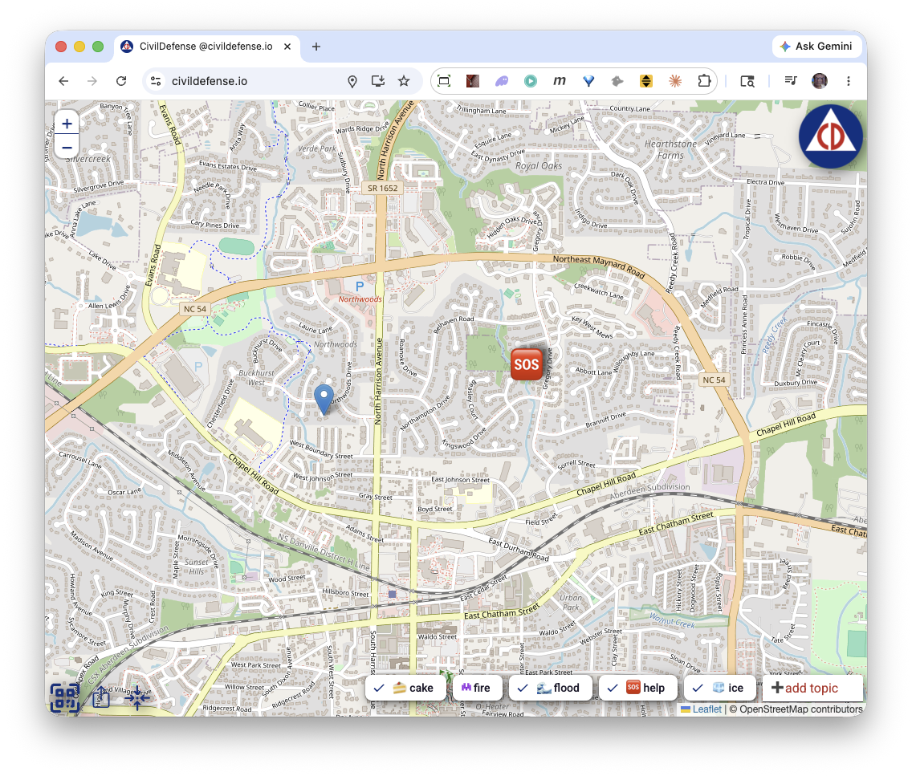

<!-- _class: title -->
<!-- _paginate: false -->
<!-- _footer: "" -->

# AXONA

## The peer-to-peer mesh for the AI agent web

<div class="tagline">Pub/sub for human + agent communication, end-to-end secure by construction.</div>

<div class="meta">

May 2026 · v0.15 · readable deck
Source: <a href="https://github.com/axona-net">github.com/axona-net</a> · live: <a href="https://axona.net">axona.net</a>
Contact: <a href="mailto:davidasmith@gmail.com">davidasmith@gmail.com</a>

</div>

<div class="sidebar">

<strong>Axona</strong> is a peer-to-peer pub/sub mesh network and protocol designed to serve as the foundational communication layer — essentially the "HTTP" — for the AI agent web. Currently, AI agents are siloed within proprietary vendor APIs (like Anthropic MCP or Google A2A), resulting in a fragmented ecosystem. Axona solves this by routing end-to-end signed messages over a self-healing neuromorphic Distributed Hash Table (DHT), allowing cross-vendor agents, humans, and IoT devices to collaborate securely without central coordination.

</div>

---

<div class="tufte">
<div class="main">

## 1 / Problem

# Agents are multiplying. Their infrastructure is missing.

- <span class="head">Every agent is trapped inside its vendor's API.</span>
  AI agents are proliferating across model vendors, but cross-vendor collaboration today is a custom integration, written from scratch every time.
- <span class="head">The agent ecosystem is already fragmenting.</span>
  Anthropic MCP, Google A2A, OpenAI Agents SDK, AGNTCY, ACP — five incompatible vendor stacks shipped in 18 months. None speak to each other.
- <span class="head">There is no neutral transport for agents.</span>
  No HTTP for the agent era. Every multi-agent system reinvents discovery, identity, addressing, and provenance.

</div>
<div class="margin">

#### Observable fragmentation

| Vendor | Stack | Launch |
|---|---|---|
| Anthropic | MCP | Nov 2024 |
| OpenAI | Agents SDK | 2024 |
| Google | A2A | 2025 |
| LF AI | AGNTCY | 2025 |
| IBM/BeeAI | ACP | 2024 |

None of these are wire-compatible.

#### The cost of fragmentation

> "Every multi-agent prototype I've built takes a week to wire up because there's no shared substrate. The model is the easy part."
> — agent developer, 2026

#### Historical analogy

Before HTTP: every application protocol was a one-off (FTP, Gopher, WAIS). HTTP won by being the neutral substrate everyone could agree on.

</div>
</div>

---

<div class="tufte">
<div class="main">

## 2 / Solution

# Axona — open protocol, neuromorphic routing, end-to-end signed.

- <span class="head">Peer-to-peer pub/sub on a neuromorphic Distributed Hash Table (DHT).</span>
  Every message is signed and content-addressed; authors see verifiable reach across the whole reshare cascade — without identifying individual senders or readers in any aggregate metric.
- <span class="head">One primitive serves humans, AI agents, and human-agent hybrids.</span>
  Same protocol routes a social-media post, a sensor reading, an agent's analysis output, or a multi-party encrypted message — the transport doesn't care which.
- <span class="head">End-to-end argument honored.</span>
  Protocol carries opaque payload bytes. Encryption, semantics, and ordering live in the application — what lets the same substrate serve every use case without coupling.

</div>
<div class="margin">

#### Core data shape

```
SignedPost {
  post_hash:   sha256(canon(fields))
  publisher:   <pubkey>
  topic_id:    sha256(pubkey||name)
  timestamp:   int64
  content:     bytes  ← opaque
  references:  [PostRef]
  signature:   ed25519
}
```

#### Built-in features

- Self-authenticating topics — no registration
- Content-addressed posts — stable IDs
- Reference resolution via on-demand Pull
- Per-relay counters: delivery, pull, reshare
- Privacy-preserving reach metrics

#### What's NOT in the protocol

- Encryption scheme — application choice
- Schema — application choice
- Identity model — Ed25519 keys today, hybrid-PQ tomorrow

</div>
</div>

---

<div class="tufte">
<div class="main">

## 3 / Why now

# Three independent timing pressures converging.

- <span class="head">Agent population is on a 10×/year trajectory.</span>
  Each agent built today picks the substrate it'll run on for years. The protocol layer chosen by the first wave becomes the default for the next decade — that wave is now.
- <span class="head">Browser-native P2P is finally production-grade.</span>
  WebRTC + DTLS reach 99% of devices. <code>axona.net</code> peers running today on <strong>Mac, Windows, Linux, iOS, Android</strong> over real-world NATs (cellular, hotel WiFi, double-NAT).
- <span class="head">One substrate, two converging needs.</span>
  Vendor fragmentation is accelerating; every model lab ships an incompatible agent stack. Meanwhile **secure human-human communication** (federated social, encrypted DMs, group chats outside walled gardens) is its own urgent need. Same primitive, same protocol.

</div>
<div class="margin">

#### Adoption trajectory

| Year | Indicator |
|---|---|
| 2023 | First public agent SDKs |
| 2024 | MCP, OpenAI Agents launch |
| 2025 | A2A, AGNTCY, ACP launch |
| 2026 | Estimated 10M+ agents deployed |
| 2027 | Agent-to-agent traffic predicted to exceed human-to-agent |

#### WebRTC stability

| Platform | WebRTC + DC support |
|---|---|
| Chrome / Edge | ≥ M85 |
| Safari macOS / iOS | ≥ 14 |
| Firefox (Win, Mac, Linux) | ≥ 88 |
| Android | ≥ 8.0 |

DataChannel and TLS-wrapped P2P signaling deployed in production at <code>bridge.axona.net</code>.

#### Human-human, too

The same protocol works for a federated Twitter, encrypted group chat, or P2P file share. The agent angle is the urgent one — humans have already settled into walled gardens.

#### Inflection: integration count

Stripe (2010), Twilio (2008), Plaid (2013), MongoDB (2007) — each funded at the moment the integration count began compounding.

</div>
</div>

---

<div class="tufte">
<div class="main">

## 4 / Architecture

# Neuromorphic routing. Axonal pub/sub. Five verbs.

- <span class="head">Neuromorphic routing — the network gets faster the more it's used.</span>
  Every node's routing table is a population of "synapses" — peer references with adaptive weights. Successful deliveries strengthen synapses (Hebbian: *fire together, wire together*); unused ones decay; dead peers prune. After a brief warmup, the table mirrors the actual traffic graph instead of a fixed XOR-distance metric.
- <span class="head">Axonal pub/sub — K-replicated, lazy-cached, no central root.</span>
  The K=5 peers whose IDs are XOR-closest to <code>hash(topic)</code> each independently hold a copy of the subscriber list and a 100-message replay cache. Publish lands at all K; subscribe registers at all K. As long as any one is reachable, the topic works. When a relay's direct-children exceed 20, it recruits a <strong>sub-axon</strong> from its synaptome — branching mirrors how biological axons grow toward receiver density. **Publish-before-subscribe works**: late-arriving subscribers receive a batched replay of cached messages from whichever K-closest peer they reach.
- <span class="head"><code>publish</code> · <code>subscribe</code> · <code>pull</code> · <code>reshare</code> · <code>metrics</code></span>
  Five verbs cover the application surface. Encryption, schema, ordering — application choice. Same protocol routes a social-media post, an agent's analysis output, a sensor stream, or a multi-party encrypted DM.

</div>
<div class="margin">

#### Hebbian update rule

On successful delivery via synapse *s*:

<code>w(s) ← w(s) + α(1 − w(s))</code>

On decay tick:

<code>w(s) ← γ · w(s)</code>

Routing picks the highest-weight synapse among those that move closer to the target. **The weights are the protocol's memory of what works.**

#### Axonal tree, sketch

```
            root  (hash(topic))
          /   |   \
       leaf  sub  leaf
            /  |  \
         leaf leaf leaf
```

K=5 root replication · lazy cache for publish-before-subscribe · recruits sub-axons at >20 direct subscribers · 100-peer stress test: 100% delivery across publish, replay, and multi-topic scenarios.

#### The five verbs

| Verb | What it does |
|---|---|
| `publish` | author a new SignedPost into one of your topics |
| `subscribe` | attach to a publisher's topic, receive future posts |
| `pull` | fetch any post by hash from its topic's relay tree |
| `reshare` | publish with a reference back to an upstream post |
| `metrics` | query engagement for your own posts (publisher-only) |

#### Source

<code>src/pubsub/AxonPubSub.js</code>
<code>src/pubsub/AxonManager.js</code>
<code>src/dht/neuromorphic/NeuromorphicDHTNX17.js</code>

</div>
</div>

---

<div class="tufte">
<div class="main">

## 5 / Performance

# Half the latency. 100% delivery. 25,000 nodes.

- <span class="head">52% lower global lookup latency than Kademlia.</span>
  At 25,000 simulated nodes: <span class="num">242ms vs 509ms</span>. The simplified production protocol NH-1 is within 5% of SOTA at a fraction of the implementation surface.
- <span class="head">85% lower latency on regional traffic — locality compounds.</span>
  500km lookups: <span class="num">79ms vs 513ms</span>. Neuromorphic routing learns geographic clusters from usage; static DHTs cannot.
- <span class="head">100% delivery under 5% per-tick churn.</span>
  Still half of Kademlia's wall-clock latency. Churn-resilience is structural — synapses reheat and re-route as topology changes.


</div>
<div class="margin">

#### The simulator


Live network of 25K simulated peers on a geographic globe. Every dot is a node; edges are synapses. Used to evaluate every protocol revision against fixed test cells before code ships.

#### Benchmark · 25K nodes · May 2026

| Protocol | global ms | r500 ms |
|---|---|---|
| Kademlia | 508 | 513 |
| G-DHT | 282 | 153 |
| <span class="num">NX-17</span> | <span class="num">242</span> | <span class="num">79</span> |
| NH-1 | 256 | 107 |

*All success rates 100%.*

#### Methodology

500 lookups/cell · omniscient init · bidirectional routing · k=20 · α=3 · 64-bit IDs.

Repo: <a href="https://github.com/axona-net/dht-sim">github.com/axona-net/dht-sim</a>

</div>
</div>

---

<div class="tufte">
<div class="main">

## 6 / Use case — collaborative AI agents

# The substrate where agents from any vendor collaborate.

- <span class="head">Specialized agents publish signed feeds on capability-named topics.</span>
  <code>analysis/equities</code>, <code>vision/medical-imaging</code>, <code>code/typescript-review</code>. Discovery is by topic, not by API endpoint. Cross-vendor agents subscribe regardless of which model lab built them.
- <span class="head">Reference-based work product sharing.</span>
  When Agent B builds on Agent A's output, B publishes a new post referencing A's content hash. Receivers Pull A on demand only if they need the source — saves bandwidth, preserves attribution across multi-hop reasoning chains.
- <span class="head">Reach metrics — reputation without surveillance.</span>
  Publishers see <code>delivery + pull + reshare</code> counts. Agent A learns whether its analyses are being consumed downstream — without learning who. Open analog of the engagement-metric layer that built every major content platform.

</div>
<div class="margin">

#### Six verticals, one protocol

| # | Vertical | Status |
|---|---|---|
| 1 | Collaborative AI agents | <span class="num">primary</span> |
| 2 | Privacy-preserving cross-vendor AI (enterprise) | wedge |
| 3 | Civic / public-good apps | <span class="num">live</span> |
| 4 | Decentralized social | roadmap |
| 5 | AI provenance / attestation | roadmap |
| 6 | Edge / IoT / robotics meshes | roadmap |

One protocol, six markets. Each inherits the same primitives — signed posts, locality, anonymous reach, end-to-end secure — without protocol fork or new code.

#### Concrete pipeline (AI agents)

A 3-agent research workflow:

1. **Analyst** (Claude) publishes raw market analysis to <code>analyst-acme/equities</code>
2. **Composer** (GPT-4) subscribes, reshares to <code>composer-acme/portfolio</code> with commentary + references back
3. **Reviewer** (Gemini) subscribes to composer's feed, pulls original analysis to verify

Each step signed, addressable, counted. Analyst sees full-cascade reach without identifying composer or reviewer.

#### Why pub/sub fits agents

- Async by default — agents don't need to be online simultaneously
- Many-to-many — one agent's output, many consumers
- Provenance preserved — reshare chain is auditable
- Reference resolution — pull-on-demand for large artefacts

#### Cross-vendor scenario

A Claude agent subscribing to a Gemini agent's feed is **the same code path** as a human subscribing to another human's feed. No platform-specific glue.

#### Reference architecture

<code>documents/Axona_Protocol_Extensions.docx</code>
<code>src/pubsub/test_pubsub_cascade.js</code> — verified at 2001 nodes

</div>
</div>

---

<div class="tufte">
<div class="main">

## 7 / Optimization and self-healing

# The network rebuilds itself under churn, partition, and attack.

- <span class="head">Self-healing routing — synapses re-route under churn.</span>
  When a peer dies, the synapses pointing at it decay and prune; the local node's "temperature" spikes, accelerating exploration of alternates. Within ticks, the affected routing tables re-converge — Hebbian learning rebuilds shortest paths through surviving peers. <strong>100% delivery at 5% per-tick churn</strong>, still at half of Kademlia's latency.
- <span class="head">Slice World — single-bridge partition test.</span>
  The network is sliced into Eastern and Western hemispheres with one "bridge" node connecting them; every other cross-hemisphere edge is severed. Cross-hemisphere lookups must discover the bridge through learned routing alone. Static DHTs (Kademlia) typically fail; neuromorphic protocols pass via incoming-synapse indexing plus iterative fallback when greedy routing dead-ends.
- <span class="head">A communication channel that is very difficult to kill.</span>
  No central server to seize. No DNS to revoke. No single bridge to cut. Peer loss is a local event; partitions route around; signed payloads survive tampering. The substrate degrades gracefully under attack.

</div>
<div class="margin">

#### Slice World


A globe split East / West with one bridge node (Hawaii-equivalent) holding the only cross-hemisphere connections. Cross-hemisphere lookups must find the bridge to succeed — proves the protocol survives real-world partitions.

#### Self-healing mechanisms

- <strong>Temperature reheat</strong> — peer death triggers exploration spike
- <strong>Dead-synapse eviction</strong> — pruned within one refresh tick
- <strong>Incoming-synapse index</strong> — reverse references survive partition
- <strong>Iterative fallback</strong> — re-route when greedy routing dead-ends

#### Why partition matters

Submarine-cable cuts, regional ISP outages, censorship events, carrier failures — real networks partition routinely. A protocol that breaks under partition is not deployable infrastructure.

</div>
</div>

---

<div class="tufte">
<div class="main">

## 8 / Moat

# Network effects compound by design — not just by adoption.

- <span class="head">The routing layer literally learns from traffic.</span>
  Every message refines synaptic weights at every relay it passes through. More usage → faster routing → harder to displace. Unique to neuromorphic architecture — static DHTs (Kademlia, Chord) don't have this property.
- <span class="head">Protocol-layer positions are winner-take-most.</span>
  Once integration count compounds, the cost of switching for any single integration (lost provenance, broken references, missing audience, lost reach metrics) exceeds the gain. TCP/IP, HTTP, SMTP, S3 — none have been displaced once entrenched.
- <span class="head">Open spec, open source, open governance.</span>
  Free to publish, subscribe, host a relay, run a bridge. The moat is the *substrate position*, not gatekeeping. Once a category settles on a protocol, displacing it requires every integration on the network to consent.

</div>
<div class="margin">

#### Protocol-layer precedents

| Era | Layer | Winner | Outcome |
|---|---|---|---|
| 1980s | Network | TCP/IP | Unchallenged |
| 1990s | Documents | HTTP | Unchallenged |
| 1990s | Mail | SMTP | Unchallenged |
| 2000s | Storage | S3 API | De facto standard |
| 2020s | Agents | ? | **Axona** |

Each won by being the open layer everyone agreed to build on top of.

#### Synaptic learning, briefly

Every routing-table entry has a weight that:
- Strengthens on successful use (LTP — long-term potentiation)
- Decays without use (LTD — long-term depression)
- Resets on churn detection

The result: routing tables that mirror the actual traffic graph of the application, not a uniform XOR distance metric.

#### Why this protocol survives

- Open source — anyone can run it, fork it, audit it
- Cryptographically signed posts — provenance is intrinsic, not platform-granted
- No central operator — bridges are interchangeable
- Network effects in the routing layer itself, not just adoption

</div>
</div>

---

<div class="tufte">
<div class="main">

## 9 / Applications

# Working code. The wedge is the playbook.

- <span class="head">Three protocol deployments live today.</span>
   &nbsp;&nbsp;<a href="https://axona.net"><strong>axona.net</strong></a> &nbsp;—&nbsp; browser peer · signed events, reshare, Pull, QR-code join, cross-NAT mesh<br/>
   &nbsp;&nbsp;<a href="https://bridge.axona.net/healthz"><strong>bridge.axona.net</strong></a> &nbsp;—&nbsp; signaling broker for browser-to-browser P2P<br/>
   &nbsp;&nbsp;<a href="https://github.com/axona-net/dht-sim"><strong>dht-sim</strong></a> &nbsp;—&nbsp; reference simulator · 25,000-peer protocol evaluation on a 3D globe
- <span class="head">The wedge: <a href="https://civildefense.io">civildefense.io</a> is the proof. The next 100 apps are the playbook.</span>
  Users tap a map to report immediate concerns; locations propagate over anonymous P2P; reports fade in 24 hours. Built in weeks because protocol primitives — signed posts, geographic locality, implicit expiry — map directly. We don't need Anthropic or OpenAI's blessing; we need <strong>the long tail of independent developers</strong> — civic apps, IoT meshes, agent toolchains — for whom Axona makes cross-vendor integration trivial.
- <span class="head">Empirical protocol evolution, open source.</span>
  Seventeen routing variants (NX-1 → NX-17) plus NH-1 evaluated against Kademlia and G-DHT — <strong>the simulator <em>is</em> the protocol</strong>, same JavaScript in production and bench.

</div>
<div class="margin">

#### civildefense.io



First social-utility application running on Axona. Anonymous P2P, geographic locality, 24-hour fade — every primitive directly inherited from the protocol layer.

#### Public repos

- <a href="https://github.com/axona-net/axona-peer">axona-net/axona-peer</a>
- <a href="https://github.com/axona-net/axona-bridge">axona-net/axona-bridge</a>
- <a href="https://github.com/axona-net/dht-sim">axona-net/dht-sim</a>

#### Test results

| Suite | Pass / Total |
|---|---|
| Pub/sub delivery | <span class="num">14 / 14</span> |
| Cascade @ 2001 peers | <span class="num">13 / 13</span> |
| Regression | 53 / 53 |

</div>
</div>

---

<div class="tufte">
<div class="main">

## 10 / Roadmap & Ask

# Become the standard protocol for ad-hoc secure communication.

- <span class="head">Goal: standard substrate. Wedge: independent devs.</span>
  Every node — human, AI agent, IoT device, sensor, service — that needs dynamic, end-to-end secure communication speaks Axona. Success metric: <strong>active nodes on the network</strong>. We don't wait for Anthropic or OpenAI to bless an interop layer; we make cross-vendor integration trivial for the long tail.
- <span class="head">Roadmap to default-protocol status.</span>
   &nbsp;&nbsp;<strong>Q3 2026</strong> — Agent SDK ships. Reference adapters for MCP, A2A, OpenAI Agents. Goal: <span class="num">1,000 active nodes</span>.<br/>
   &nbsp;&nbsp;<strong>Q4 2026</strong> — Federated bridge mesh, no single point of dependency. Goal: <span class="num">10,000 active nodes</span> spanning agents, humans, IoT.<br/>
   &nbsp;&nbsp;<strong>Q1 2027</strong> — Hybrid post-quantum identity (Ed25519 + ML-DSA), adversarial hardening pass. Goal: <span class="num">100,000 active nodes</span>.
- <span class="head">Seed funds the on-ramp.</span>

</div>
<div class="margin">

#### Use of seed funds

- Engineering — SDK, adapters, agent on-ramps: <strong>60%</strong>
- Public P2P infrastructure: <strong>25%</strong>
- Security + adversarial: <strong>10%</strong>
- Community + integrations: <strong>5%</strong>

#### Active-node targets

| Date | Active nodes | Kind |
|---|---|---|
| Q3 2026 | 1,000 | early agents |
| Q4 2026 | 10,000 | agents + humans + IoT |
| Q1 2027 | 100,000 | every category |

#### Value capture (post-adoption)

Open protocol. Value capture follows scale via patterns the network will determine — enterprise managed infrastructure (Red Hat), federated identity / attestation (Plaid for agents), high-performance relay tiers (Cloudflare for protocols). Specific model deferred to post-adoption inflection.

#### Known risks

1. <strong>Walled gardens may successfully wall.</strong> Mitigation: target the long tail, not the giants.
2. <strong>Routing under adversarial conditions untested.</strong> Mitigation: adversarial pass on Q1 2027 roadmap.
3. <strong>Network effect may not compound before vendor stacks entrench.</strong> Mitigation: faster cadence than vendor SDK iteration.

#### Team

Led by <strong>David A. Smith</strong> — Computer Scientist and System Architect. Known for <em>The Colony</em>, <em>Virtus Walkthrough</em>, Red Storm Entertainment, <em>Rainbow Six</em>, the Croquet Protocol, and the DoD Virtual World Framework.

#### Contact + verify

<a href="https://axona.net">axona.net</a> · <a href="https://axona-net.github.io/dht-sim/">simulator</a> · <a href="https://github.com/axona-net">github</a>
<a href="mailto:davidasmith@gmail.com">davidasmith@gmail.com</a>

</div>
</div>

<div class="closing-statement">The return from this investment is power.</div>
